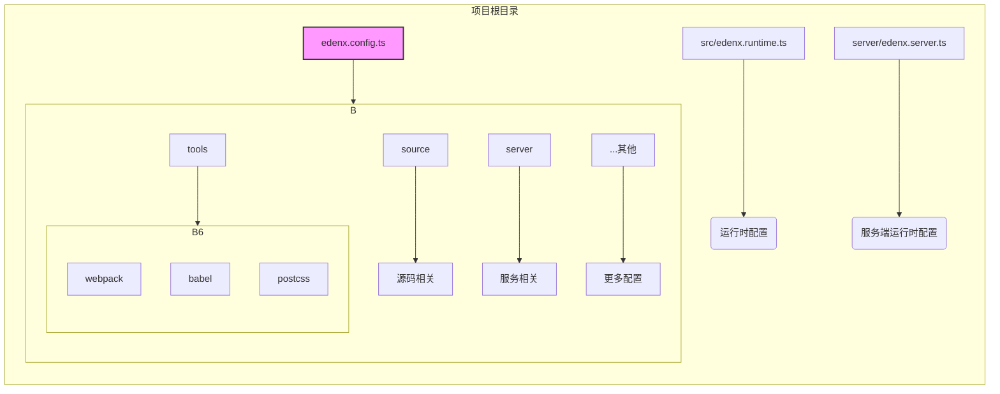

## 4. EdenX 配置

EdenX 提供了强大而灵活的配置系统，允许开发者对项目的方方面面进行个性化设置。理解配置系统是高效使用 EdenX 的关键。::cite[17]

### 4.1. 配置文件类型

EdenX 主要有三种类型的配置文件，分别对应不同的阶段和作用域：::cite[17]

*   **编译时配置 (`edenx.config.ts`):** 这是最核心的配置文件，位于项目根目录。它用于定义所有与构建和编译相关的设置，如打包工具、别名、环境变量等。推荐使用 `.ts` 格式以获得类型提示。::cite[17]
*   **运行时配置 (`src/edenx.runtime.ts`):** 用于配置客户端运行时的行为，例如路由、状态管理、请求库等。::cite[17]
*   **服务端运行时配置 (`server/edenx.server.ts`):** 用于配置 BFF (服务于前端的后端) 和 SSR (服务器端渲染) 相关的服务端逻辑。::cite[17]

### 4.2. 编译时配置 (`edenx.config.ts`)

这是最常用到的配置文件。我们推荐使用 `defineConfig` 工具函数来创建配置，以获得良好的类型推导和自动补全。::cite[17]

```typescript
// edenx.config.ts
import { defineConfig } from '@edenx/app-tools';

export default defineConfig({
  source: {
    alias: {
      '@common': './src/common',
    },
  },
  server: {
    ssr: true,
  },
  tools: {
    // 配置底层工具
  },
});
```

**切换到 Rspack:**

当使用 Rspack 作为打包工具时，需要为 `defineConfig` 指定泛型，因为 Webpack 和 Rspack 的配置类型存在差异。::cite[17]

```typescript
// edenx.config.ts
import { defineConfig } from '@edenx/app-tools';

// 指定使用 'rspack' 配置类型
export default defineConfig<'rspack'>({
  // ... Rspack 相关配置
});
```

### 4.3. 配置底层工具

EdenX 允许开发者深入到底层，对集成的工具进行精细化配置。这通过 `tools` 命名空间实现。::cite[21]

你可以为一个工具的配置提供一个对象（与默认配置合并）或一个函数（直接修改默认配置）。::cite[21]

**示例：修改 Webpack 配置**

```typescript
// edenx.config.ts
import { defineConfig } from '@edenx/app-tools';

export default defineConfig({
  tools: {
    webpack: (config, { webpack }) => {
      // 添加一个新的 webpack 插件
      config.plugins.push(new webpack.BannerPlugin('My Awesome App'));

      // 注意：函数内可以直接修改 config 对象，无需返回
    },
    babel: (babelConfig) => {
      // 添加一个新的 babel 插件
      babelConfig.plugins.push('babel-plugin-my-plugin');
    },
    postcss: (postcssConfig) => {
        // 修改 postcss 配置
    }
  },
});
```

目前支持的底层工具配置包括：::cite[21]

*   `tools.devServer`
*   `tools.babel`
*   `tools.webpack` / `tools.rspack`
*   `tools.postcss`
*   `tools.less` / `tools.sass`
*   `tools.terser`
*   `tools.styledComponents`

### 4.4. 配置项迁移

EdenX 提供了详细的迁移指南和配置映射关系，帮助开发者从旧版本的 Eden 或 Jupiter 迁移到 EdenX。文档中清晰地列出了约 200 个配置项的对应关系。::cite[14]

例如，从 Eden v2 迁移 `abilities.js.presetEnvOptions` 配置：

*   **Eden v2 配置 (`eden.config.js`):**
    ```javascript
    { abilities: { js: { presetEnvOptions: { ... } } } }
    ```
*   **EdenX 配置 (`edenx.config.ts`):**
    ```typescript
    { tools: { babel: (cfg, { modifyPresetEnvOptions }) => modifyPresetEnvOptions(...) } }
    ```

官方提供了完整的[配置映射文档](https://bytedance.larkoffice.com/wiki/wikcnDe6XjyzPQnbnxLWYf854ee)，可以作为迁移时的重要参考。::cite[13]

### 4.5. 配置结构图


