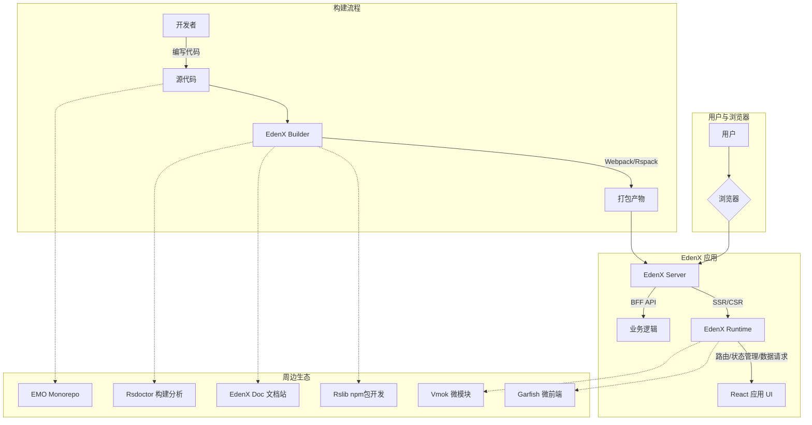

# EdenX 知识库

## 1. EdenX 介绍

EdenX 是一个基于 React 的渐进式现代 Web 开发框架，由字节跳动 Web Infra 团队推出。::cite[3] 它是公司内部广泛使用的两大框架 Eden 和 Jupiter 的融合体，旨在结合二者优势，为开发者提供极致的开发体验和卓越的应用性能。::cite[3]

EdenX 的核心设计理念是“渐进式”，开发者可以从一个最精简的模板开始，逐步按需引入功能，以满足不同规模和复杂度的应用需求。::cite[6] 它内置了强大的构建工具、完善的运行时方案和一体化的服务端支持，覆盖了从开发、调试到部署的全流程。::cite[3]

### 1.1. 核心组件

EdenX 主要由以下三个核心部分组成：::cite[3]

*   **构建器 (Builder):** 负责应用的编译和打包。它基于强大的 Rspack 和 Webpack，提供了高性能的构建能力，并支持通过插件进行灵活扩展。::cite[3]
*   **运行时 (Runtime):** 提供应用运行所需的基础能力，包括路由管理、状态管理、数据请求、渲染模式切换等，并集成了 Slardar、Tea、Garfish 等公司内部常用的基础库。::cite[3]
*   **服务端 (Server):** 提供统一的开发和生产环境 Web Server，并内置了对 SSR (服务器端渲染) 和 BFF (服务于前端的后端) 的开箱即用支持。::cite[3]

### 1.2. 设计原则

*   **渐进式 (Progressive):** 允许开发者根据项目需求，从一个最小化的实现开始，逐步增加功能。::cite[6]
*   **一体化 (Integration):** 提供从开发到生产的统一 Web Server，支持 CSR 和 SSR 同构开发，以及函数即接口的 API 服务调用。::cite[6]
*   **开箱即用 (Out Of The Box):** 内置 TypeScript 支持、构建工具、ESLint、调试工具等，让开发者可以专注于业务逻辑。::cite[6]
*   **强大的生态 (Ecology):** 拥有自研的状态管理、微前端、模块打包、Monorepo 等解决方案，并与社区优秀方案深度集成。::cite[7]

### 1.3. 架构图

通过本知识库，你将深入了解 EdenX 的各项功能、核心原理、配置方法、生态系统及常见应用场景，从而能够高效地利用 EdenX 构建现代化 Web 应用。

