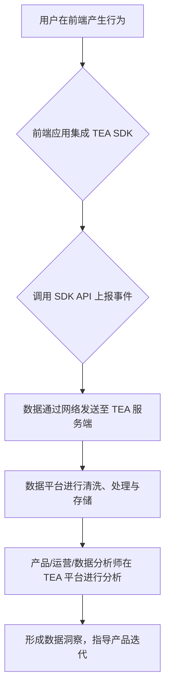

# TEA 前端知识库

**最后更新时间：2025-12-02**

本知识库专为前端工程师打造，聚焦于 **Web 端和各类小程序** 的数据采集与集成实践。我们致力于提供准确、可落地、可直接复制使用的中文文档，帮助你快速、规范地完成 TEA 埋点接入。

## 1. TEA 是什么？

TEA，全称为 **Toutiao Event Analysis**，是字节跳动内部统一的用户行为分析平台。它提供了一套完整的数据解决方案，旨在帮助业务团队通过事件（Event）追踪和分析，实现精细化的数据驱动决策。[[10]](https://bytedance.larkoffice.com/wiki/wikcnZXhLbCcWqGzPdRUD7j66cb?from=lark_search_qa&ccm_open_type=lark_search_qa#doxcngDes7MByAdNyYF4haqxQof)

对于前端工程师而言，TEA 主要体现在其提供的一系列 **SDK**（软件开发工具包）。通过在 Web、小程序、iOS、Android 等客户端中集成这些 SDK，我们可以方便地采集用户的各类行为数据（如页面浏览、点击、曝光、表单提交等），并将这些数据上报至数据分析平台，供后续的分析和使用。

### 核心概念

在开始之前，理解 TEA 的几个核心概念至关重要：

*   **事件 (Event)**：用户在产品中的一次具体行为，是数据分析的基本单位。例如，"点击按钮"、"页面浏览"、"成功提交表单"等。每个事件都有一个唯一的事件名称。
*   **属性 (Property)**：描述事件发生时或用户本身的详细信息，分为事件属性和用户属性。例如，"点击按钮"事件可以有"按钮颜色"、"按钮位置"等事件属性；用户可以有"年龄"、"性别"、"会员等级"等用户属性。
*   **用户 (User)**：产品的使用者。TEA 通过唯一的 ID（如 `user_unique_id`）来识别和追踪单个用户，以构建完整的用户行为路径。
*   **会话 (Session)**：用户在一次连续访问中的一系列活动。通常从用户打开应用/网站开始，到用户关闭或长时间无操作结束。

TEA 的核心能力包括但不限于：

*   **事件分析**：对特定用户行为的发生次数、频率、分布进行统计分析。
*   **留存分析**：衡量用户在首次使用产品后，经过一段时间是否仍然持续活跃。
*   **转化分析**：通过漏斗模型，分析用户在完成某个关键目标（如注册、购买）的过程中，每一步的流失率和转化率。
*   **分群分析**：根据用户的属性或行为特征，将用户划分为不同的群体，以便进行更具针对性的观察和运营。

## 2. 前端接入的作用与数据流

前端是用户行为数据产生的源头。作为前端工程师，我们在产品中接入 TEA SDK，扮演着“数据生产者”的关键角色。我们的主要职责是：

1.  **正确安装和初始化 SDK**：确保 SDK 在应用启动时被正确加载和配置。
2.  **精准捕获用户行为**：在用户执行关键操作的节点，调用 SDK 的 API 上报事件。
3.  **丰富数据维度**：为上报的事件附带上必要的上下文属性（Properties），如当前页面、模块、来源等，使数据更具可分析性。
4.  **管理用户身份**：在用户登录或身份明确时，将业务的用户 ID 与 TEA 的匿名 ID 进行绑定，以实现跨设备、跨平台的行为追踪。

**数据流简述：**

## 3. 常见应用场景

以下是前端接入 TEA 后，可以支持的一些典型分析场景：

*   **衡量新功能效果**
    *   **场景**：产品新上线了一个“一键收藏”功能，需要评估其受欢迎程度。
    *   **前端埋点**：在用户点击“一键收藏”按钮时，上报一个名为 `collect_button_click` 的自定义事件。
    *   **数据分析**：通过分析该事件的触发总次数、触发用户数、人均触发次数，可以量化该功能的整体使用情况。

*   **优化注册转化漏斗**
    *   **场景**：希望提升用户的注册转化率，需要定位流失最严重的环节。
    *   **前端埋点**：
        1.  用户进入注册页时，上报 `view_register_page` 事件。
        2.  用户输入手机号后，上报 `enter_phone_number` 事件。
        3.  用户点击“获取验证码”按钮时，上报 `click_get_sms_code` 事件。
        4.  用户成功提交注册表单时，上报 `submit_register_success` 事件。
    *   **数据分析**：在 TEA 平台配置一个包含以上四个事件的转化漏斗，即可清晰地看到用户从进入页面到最终注册成功的每一步转化率和流失率，从而找到优化重点。

*   **分析不同渠道的页面访问量 (PV)**
    *   **场景**：市场部门在多个渠道（如微信、微博、抖音）投放了产品落地页，需要评估各渠道的引流效果。
    *   **前端埋点**：SDK 会自动或通过简单配置，在页面加载时上报 `predefine_pageview`（页面浏览）事件。该事件会自动携带页面 URL、来源（`referrer`）等信息。如果需要更精细的渠道追踪，可以在投放链接中加入 UTM 参数。
    *   **数据分析**：通过对 `predefine_pageview` 事件进行分析，并按 `utm_source`（UTM 来源）或 `referrer`（来源页面）等维度进行分组，即可对比不同渠道带来的访问量差异。

---

### 参考资料

*   [Tea前端接入指南](https://bytedance.larkoffice.com/wiki/wikcnZXhLbCcWqGzPdRUD7j66cb)[[10]](https://bytedance.larkoffice.com/wiki/wikcnZXhLbCcWqGzPdRUD7j66cb?from=lark_search_qa&ccm_open_type=lark_search_qa#doxcngDes7MByAdNyYF4haqxQof)
