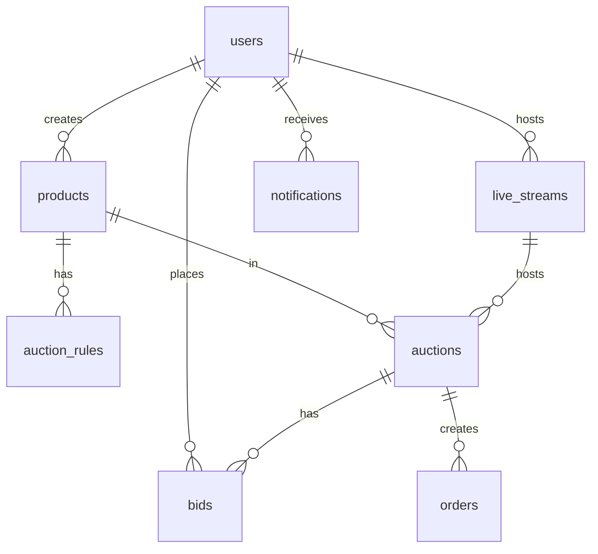

# 数据库结构文档

## 数据库架构
本项目使用MySQL数据库，包含product-service和auction-service两个主要数据库。

## 表结构概览

### product-service 数据库

| 表名 | 说明 | 主要字段 |
|------|------|----------|
| users | 用户表 | ID, Name, Avatar, Email, Phone, Role, Status |
| categories | 类别表 | ID, Name, Code, Description, SortOrder |
| products | 商品表 | ID, Name, Description, Images, CategoryID, Status |
| live_streams | 直播间表 | ID, CreatorID, Name, Description, CoverImage, Status |
| auction_rules | 竞拍规则表 | ID, ProductID, StartPrice, Increment, CapPrice |
| orders | 订单表 | ID, AuctionID, ProductID, WinnerID, FinalPrice, Status |

### auction-service 数据库

| 表名 | 说明 | 主要字段 |
|------|------|----------|
| auctions | 竞拍表 | ID, ProductID, LiveStreamID, Status, CurrentPrice |
| bids | 出价表 | ID, AuctionID, UserID, Amount |
| notifications | 通知表 | ID, UserID, Type, Title, Content, ReadAt |
| sky_lamp_subscriptions | 点天灯订阅 | ID, AuctionID, UserID, Status, MaxPriceLimit |
| user_live_stream_follows | 用户关注直播间 | UserID, LiveStreamID, NotificationEnabled |
| user_product_reminders | 商品提醒订阅 | UserID, ProductID, AuctionID, NotificationEnabled |

## ER图 (Mermaid)

## 索引策略
- 主键索引：所有表的ID字段
- 外键索引：关联字段（逻辑外键）
- 业务索引：Status, CreatedAt等常用查询字段