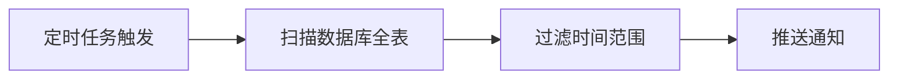
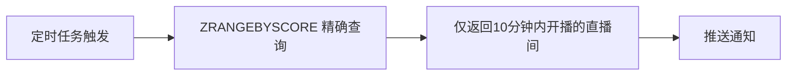

# 直播间通知"冷推热拉"技术方案（Redis ZSET版）

## 背景

当前直播间通知机制需要区分冷门和热门直播间，采用不同的通知策略：
- **冷门直播间**（关注人数 < 200）：主动推送，直播开始前10分钟推送通知
- **热门直播间**（关注人数 ≥ 200）：用户登录/切换回前台时主动拉取通知

用户订阅存在两个维度：
1. **直播间维度**：用户关注直播间（`user_live_stream_follows` 表）
2. **商品维度**：用户点击"提醒我"按钮（新增表）

---

## 核心优化：使用 Redis ZSET 替代定时任务轮询

### 问题
传统定时任务轮询会扫描全表，直播间数量增长后系统负担大。

### 解决方案
使用 Redis ZSET（有序集合）存储直播间开播时间，score 为时间戳：
- 冷推时：`ZRANGEBYSCORE` 精确获取需要推送的直播间
- 热拉时：`ZRANGEBYSCORE` 精确获取时间范围内的直播间
- **零全表扫描，O(log N) 查询效率**

---

## Redis 数据结构设计

### 1. 冷门直播间开播时间 ZSET

```
Key: live_stream:cold:start_time
Type: ZSET
Member: live_stream_id (直播间ID)
Score: scheduled_start_time_unix (计划开播时间戳，秒)
```

**用途**：冷推任务精确获取接下来10分钟内开播的冷门直播间

### 2. 热门直播间开播时间 ZSET

```
Key: live_stream:hot:start_time
Type: ZSET
Member: live_stream_id (直播间ID)
Score: scheduled_start_time_unix (计划开播时间戳，秒)
```

**用途**：热拉接口精确获取接下来1小时内开播的热门直播间

### 3. 正在直播的热门直播间 SET

```
Key: live_stream:hot:live_now
Type: SET
Member: live_stream_id (直播间ID)
```

**用途**：热拉接口快速获取当前正在直播的热门直播间

### 4. 直播间热度状态缓存

```
Key: live_stream:{live_stream_id}:stats
Type: Hash
Fields:
  - follower_count: 关注人数
  - is_hot: 是否热门（0/1）
  - status: 直播状态（offline/scheduled/live/ended）
  - scheduled_start_time: 开播时间戳
  - actual_start_time: 实际开播时间戳
```

### 5. 用户关注直播间列表 SET（用于热拉过滤）

```
Key: user:{user_id}:followed_live_streams
Type: SET
Member: live_stream_id (直播间ID)
```

**用途**：热拉时快速判断用户是否关注了某个直播间

### 6. 商品提醒订阅 ZSET（商品维度）

```
Key: user:{user_id}:product_reminders:start_time
Type: ZSET
Member: auction_id (竞拍ID，或 product_id 前缀区分)
Score: auction_start_time_unix (竞拍开始时间戳)
```

**用途**：热拉时获取用户订阅的竞拍商品即将开始的提醒

---

## 核心流程设计

### 流程一：直播间热度变更

当直播间关注人数变化时，更新 Redis 结构：

```go
func (s *LiveStreamStatsService) UpdateHotness(ctx context.Context, liveStreamID int64, followerCount int) error {
    now := time.Now().Unix()
    wasHot := s.redis.HGet(ctx, fmt.Sprintf("live_stream:%d:stats", liveStreamID), "is_hot") == "1"
    isHot := followerCount >= 200

    // 状态未变化，跳过
    if wasHot == (isHot == true) {
        // 只更新关注数
        s.redis.HSet(ctx, fmt.Sprintf("live_stream:%d:stats", liveStreamID), "follower_count", followerCount)
        return nil
    }

    scheduledStartTime := s.getScheduledStartTime(ctx, liveStreamID)

    if isHot {
        // 冷门 → 热门：从 cold ZSET 移除，加入 hot ZSET
        s.redis.ZRem(ctx, "live_stream:cold:start_time", liveStreamID)
        s.redis.ZAdd(ctx, "live_stream:hot:start_time", &redis.Z{
            Score:  float64(scheduledStartTime),
            Member: liveStreamID,
        })
    } else {
        // 烈门 → 冷门：从 hot ZSET 移除，加入 cold ZSET
        s.redis.ZRem(ctx, "live_stream:hot:start_time", liveStreamID)
        s.redis.ZAdd(ctx, "live_stream:cold:start_time", &redis.Z{
            Score:  float64(scheduledStartTime),
            Member: liveStreamID,
        })
    }

    // 更新状态缓存
    s.redis.HSet(ctx, fmt.Sprintf("live_stream:%d:stats", liveStreamID),
        "follower_count", followerCount,
        "is_hot", isHot ? 1 : 0,
    )

    return nil
}
```

### 流程二：直播间开播时间设定

当直播间设定开播时间时，加入对应 ZSET：

```go
func (s *LiveStreamService) SetScheduledStartTime(ctx context.Context, liveStreamID int64, startTime time.Time) error {
    // 1. 获取当前热度状态
    isHot := s.isLiveStreamHot(ctx, liveStreamID)
    score := float64(startTime.Unix())

    // 2. 加入对应的 ZSET
    if isHot {
        s.redis.ZAdd(ctx, "live_stream:hot:start_time", &redis.Z{
            Score:  score,
            Member: liveStreamID,
        })
    } else {
        s.redis.ZAdd(ctx, "live_stream:cold:start_time", &redis.Z{
            Score:  score,
            Member: liveStreamID,
        })
    }

    // 3. 更新状态缓存
    s.redis.HSet(ctx, fmt.Sprintf("live_stream:%d:stats", liveStreamID),
        "status", "scheduled",
        "scheduled_start_time", startTime.Unix(),
    )

    return nil
}
```

### 流程三：直播间开始直播

当直播间实际开播时，更新 Redis 结构：

```go
func (s *LiveStreamService) StartLive(ctx context.Context, liveStreamID int64) error {
    isHot := s.isLiveStreamHot(ctx, liveStreamID)

    // 1. 从开播时间 ZSET 移除（已开播）
    s.redis.ZRem(ctx, "live_stream:cold:start_time", liveStreamID)
    s.redis.ZRem(ctx, "live_stream:hot:start_time", liveStreamID)

    // 2. 如果是热门，加入正在直播 SET
    if isHot {
        s.redis.SAdd(ctx, "live_stream:hot:live_now", liveStreamID)
    }

    // 3. 更新状态缓存
    s.redis.HSet(ctx, fmt.Sprintf("live_stream:%d:stats", liveStreamID),
        "status", "live",
        "actual_start_time", time.Now().Unix(),
    )

    return nil
}
```

### 流程四：冷推定时任务（精确定位）

每5分钟执行一次，但只精确获取需要推送的直播间：

```go
func (s *ColdPushScheduler) RunColdPush(ctx context.Context) error {
    now := time.Now().Unix()
    endTime := now + 10 * 60 // 10分钟后

    // 1. 精确获取接下来10分钟内开播的冷门直播间（O(log N)）
    liveStreamIDs, err := s.redis.ZRangeByScore(ctx, "live_stream:cold:start_time", &redis.ZRangeBy{
        Min: fmt.Sprintf("%d", now),
        Max: fmt.Sprintf("%d", endTime),
    }).Result()
    if err != nil {
        return err
    }

    // 2. 遍历推送
    for _, lsIDStr := range liveStreamIDs {
        liveStreamID := strconv.ParseInt(lsIDStr, 10, 64)

        // 获取关注用户
        followers := s.getFollowers(ctx, liveStreamID)

        for _, follower := range followers {
            if !follower.NotificationEnabled {
                continue
            }

            // 创建并发送通知
            s.notificationService.SendNotification(ctx, &model.Notification{
                UserID:  follower.UserID,
                Type:    model.NotificationTypeLiveStarting,
                Title:   "直播即将开始",
                Content: "您关注的直播间将在10分钟后开播",
                Color:   "blue",
                Data:    map[string]interface{}{"live_stream_id": liveStreamID},
            })
        }

        // 3. 处理完移除（避免重复推送）
        s.redis.ZRem(ctx, "live_stream:cold:start_time", liveStreamID)

        // 4. 处理该直播间的商品提醒
        s.sendProductReminders(ctx, liveStreamID)
    }

    return nil
}
```

### 流程五：热拉接口（用户触发）

```go
func (s *NotificationService) HotPullNotifications(ctx context.Context, userID int64) ([]*model.Notification, error) {
    now := time.Now().Unix()
    oneHourLater := now + 3600

    // 1. 获取用户关注的直播间 SET
    followedSetKey := fmt.Sprintf("user:%d:followed_live_streams", userID)
    followedLiveStreams := s.redis.SMembers(ctx, followedSetKey).Val()

    // 2. 获取接下来1小时内开播的热门直播间
    hotStartingSoon := s.redis.ZRangeByScore(ctx, "live_stream:hot:start_time", &redis.ZRangeBy{
        Min: fmt.Sprintf("%d", now),
        Max: fmt.Sprintf("%d", oneHourLater),
    }).Val()

    // 3. 获取正在直播的热门直播间
    hotLiveNow := s.redis.SMembers(ctx, "live_stream:hot:live_now").Val()

    // 4. 合并并过滤（只保留用户关注的）
    var notifications []*model.Notification

    for _, lsIDStr := range hotStartingSoon {
        if contains(followedLiveStreams, lsIDStr) {
            lsID := strconv.ParseInt(lsIDStr, 10, 64)
            scheduledTime := s.redis.ZScore(ctx, "live_stream:hot:start_time", lsIDStr).Val()

            notifications = append(notifications, &model.Notification{
                UserID:  userID,
                Type:    model.NotificationTypeLiveStarting,
                Title:   "热门直播间即将开播",
                Content: fmt.Sprintf("您关注的直播间将在%d分钟后开播", (int(scheduledTime)-now)/60),
                Color:   "blue",
                Data:    map[string]interface{}{"live_stream_id": lsID},
            })
        }
    }

    for _, lsIDStr := range hotLiveNow {
        if contains(followedLiveStreams, lsIDStr) {
            lsID := strconv.ParseInt(lsIDStr, 10, 64)

            notifications = append(notifications, &model.Notification{
                UserID:  userID,
                Type:    model.NotificationTypeLiveNow,
                Title:   "直播已开始",
                Content: "您关注的直播间正在直播",
                Color:   "red",
                Data:    map[string]interface{}{"live_stream_id": lsID},
            })
        }
    }

    // 5. 获取用户订阅的商品提醒（即将开始的竞拍）
    productReminderKey := fmt.Sprintf("user:%d:product_reminders:start_time", userID)
    auctionIDs := s.redis.ZRangeByScore(ctx, productReminderKey, &redis.ZRangeBy{
        Min: fmt.Sprintf("%d", now),
        Max: fmt.Sprintf("%d", oneHourLater),
    }).Val()

    for _, auctionIDStr := range auctionIDs {
        auctionID := strconv.ParseInt(auctionIDStr, 10, 64)

        notifications = append(notifications, &model.Notification{
            UserID:  userID,
            Type:    model.NotificationTypeAuctionStarting,
            Title:   "竞拍即将开始",
            Content: "您订阅的竞拍商品即将开始",
            Color:   "red",
            Data:    map[string]interface{}{"auction_id": auctionID},
        })

        // 处理后移除
        s.redis.ZRem(ctx, productReminderKey, auctionIDStr)
    }

    // 6. 批量写入数据库
    if len(notifications) > 0 {
        s.dao.CreateBatch(ctx, notifications)
    }

    return notifications, nil
}
```

---

## 用户关注直播间时更新 Redis

```go
func (s *FollowService) Follow(ctx context.Context, userID, liveStreamID int64) error {
    // 1. 写入数据库
    // ... existing code ...

    // 2. 更新 Redis 用户关注 SET
    s.redis.SAdd(ctx, fmt.Sprintf("user:%d:followed_live_streams", userID), liveStreamID)

    // 3. 更新直播间热度统计
    newCount := s.updateFollowerCount(ctx, liveStreamID, 1)
    s.statsService.UpdateHotness(ctx, liveStreamID, newCount)

    return nil
}

func (s *FollowService) Unfollow(ctx context.Context, userID, liveStreamID int64) error {
    // 1. 删除数据库记录
    // ... existing code ...

    // 2. 更新 Redis 用户关注 SET
    s.redis.SRem(ctx, fmt.Sprintf("user:%d:followed_live_streams", userID), liveStreamID)

    // 3. 更新直播间热度统计
    newCount := s.updateFollowerCount(ctx, liveStreamID, -1)
    s.statsService.UpdateHotness(ctx, liveStreamID, newCount)

    return nil
}
```

---

## 商品"提醒我"订阅流程

```go
func (s *ProductReminderService) Subscribe(ctx context.Context, userID, productID, auctionID int64, startTime time.Time) error {
    // 1. 写入数据库
    reminder := &model.UserProductReminder{
        UserID:    userID,
        ProductID: productID,
        AuctionID: auctionID,
    }
    s.dao.Create(ctx, reminder)

    // 2. 加入用户商品提醒 ZSET
    s.redis.ZAdd(ctx, fmt.Sprintf("user:%d:product_reminders:start_time", userID), &redis.Z{
        Score:  float64(startTime.Unix()),
        Member: auctionID,
    })

    return nil
}

func (s *ProductReminderService) Unsubscribe(ctx context.Context, userID, auctionID int64) error {
    // 1. 删除数据库记录
    s.dao.Delete(ctx, userID, auctionID)

    // 2. 从 ZSET 移除
    s.redis.ZRem(ctx, fmt.Sprintf("user:%d:product_reminders:start_time", userID), auctionID)

    return nil
}
```

---

## 前端实现

### 热拉触发

```typescript
const hotPullNotifications = useCallback(async () => {
  // 检查最小间隔（30秒）
  const lastPullTime = localStorage.getItem('last_hot_pull_time');
  if (lastPullTime) {
    const elapsed = Date.now() - new Date(lastPullTime).getTime();
    if (elapsed < 30000) return;
  }

  try {
    const token = localStorage.getItem('token');
    const response = await fetch(`${API_BASE_URL}/api/v1/notifications/hot-pull`, {
      method: 'POST',
      headers: { Authorization: `Bearer ${token}` },
    });

    const data = await response.json();
    
    setState((prev) => ({
      ...prev,
      notifications: [...data.notifications, ...prev.notifications].slice(0, 50),
      unreadCount: prev.unreadCount + data.unread_count_delta,
    }));

    localStorage.setItem('last_hot_pull_time', new Date().toISOString());
  } catch (error) {
    console.error('热拉失败:', error);
  }
}, []);

// 监听页面可见性变化
useEffect(() => {
  const handleVisibilityChange = () => {
    if (document.visibilityState === 'visible') {
      hotPullNotifications();
    }
  };

  document.addEventListener('visibilitychange', handleVisibilityChange);
  return () => document.removeEventListener('visibilitychange', handleVisibilityChange);
}, [hotPullNotifications]);
```

---

## 调用链路对比

### 传统方案（定时轮询）



**问题**：O(N) 全表扫描，直播间数量增长后负担大

### Redis ZSET 方案（精确定位）



**优势**：O(log N) 查询，精确定位，零冗余扫描

---

## 通知类型与颜色

| 类型 | 颜色 | 说明 |
|-----|------|------|
| `live_now` / `auction_starting` | 红色 | 正在直播、竞拍即将开始 |
| `live_starting` | 蓝色 | 直播即将开始（冷门热门统一） |
| `auction_won` | 绿色 | 竞拍成功 |
| `bid_outbid` | 橙色 | 出价被超越 |
| `order_status` | 棕色 | 订单状态变更 |
| `auction_lost` | 灰色 | 竞拍未中标 |

---

## 性能对比

| 操作 | 传统方案 | Redis ZSET |
|-----|---------|------------|
| 冷推查询 | 扫描全表 O(N) | ZRANGEBYSCORE O(log N) |
| 热拉查询 | 扫描全表 O(N) | ZRANGEBYSCORE + SINTER O(log N) |
| 热度变更 | 无缓存，每次查DB | 直接更新ZSET，O(log N) |
| 内存占用 | 低 | 中等（ZSET存储直播间ID） |

**结论**：直播间数量超过1000后，Redis ZSET方案性能优势显著

---

## 风险点

1. **Redis 数据一致性**：数据库和 Redis 可能不一致
   - **缓解**：关键操作同时写DB和Redis，定时校验任务

2. **直播间开播时间变更**：已加入ZSET的直播间时间变化
   - **缓解**：时间变更时先ZRem再ZAdd更新score

3. **Redis 内存占用**：大量直播间会占用内存
   - **缓解**：直播结束后清理相关Key，设置TTL

---

## 实现优先级

| 阶段 | 任务 | 优先级 |
|-----|------|--------|
| 1 | Redis ZSET 数据结构初始化 | P1 |
| 2 | 关注/热度变更时更新ZSET | P1 |
| 3 | 冷推定时任务（ZRANGEBYSCORE） | P1 |
| 4 | 热拉接口实现 | P1 |
| 5 | 商品"提醒我"订阅功能 | P2 |
| 6 | 前端热拉触发集成 | P2 |
| 7 | Redis数据校验任务 | P3 |

---

**Why**: 使用 Redis ZSET 可以实现 O(log N) 精确查询，避免定时任务全表扫描，大幅降低系统负担。
**How to apply**: 按优先级实现，P1完成后基础冷推热拉功能即可上线，后续迭代增加商品维度订阅和校验任务。