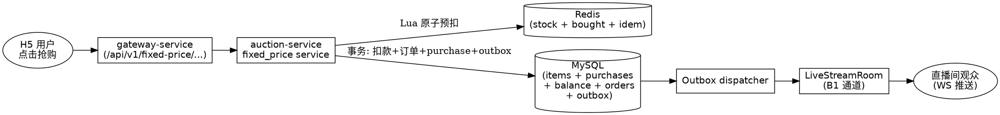
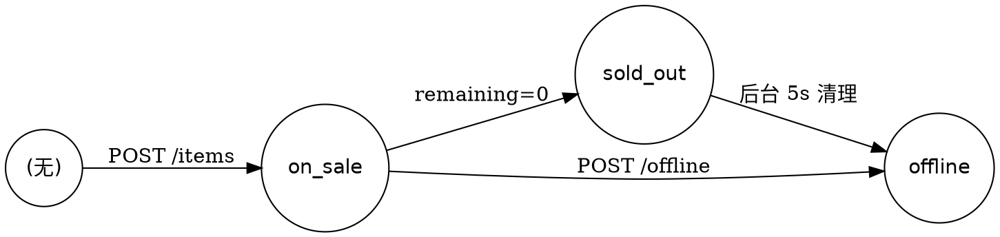
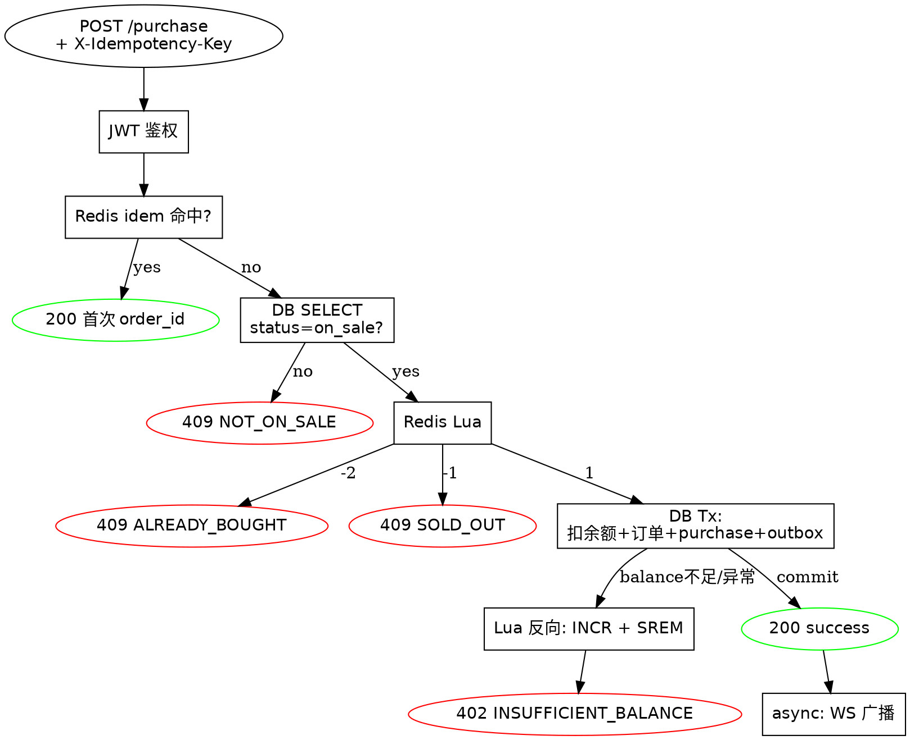

# A5 一口价秒杀（FixedPrice Sale）设计文档

> **创建日期**：2026-06-01
> **作者**：brainstorming session（基于 B1 弹幕+飘屏 spec 的发散决策）
> **状态**：Spec 已审 / 待确认进入 writing-plans

---

## 1. 背景与目标

### 1.1 背景
项目已完成 M3（用户中心 + 关注 + 订单详情）+ B1（弹幕+飘屏 spec）的设计。继续从 brainstorming 发散选项 A5（福袋/一口价穿插）中收敛，**本 spec 仅覆盖一口价秒杀子玩法**，福袋抽奖与批量混拍各自独立 spec。

### 1.2 目标
在直播间内提供**与英式拍卖并行的一口价玩法**：固定单价、限量库存、先到先得。
- 主播：丰富直播节奏，福利款留人
- 买家：低价秒杀，决策成本低
- 平台：拉高单场 GMV、留存时长

### 1.3 非目标（Out of Scope）
- 福袋抽奖（A5 子玩法 2）
- 批量混拍（A5 子玩法 3）
- 退款 / 取消订单（MVP 走人工客服）
- 商品复活（offline → on_sale 不支持）
- 库存预热、分时上架、跨直播间聚合页

---

## 2. 关键决策摘要

| 决策项 | 选择 | 理由 |
|---|---|---|
| 与拍卖关系 | **完全并行独立**，不复用 auctions 表 | 避免污染现有 bid 状态机，零回归风险 |
| 库存权威 | **Redis Lua 原子操作**，DB 兜底 | 高并发秒杀需要原子 DECR；DB 唯一键防超卖 |
| 扣款路径 | **同步扣 user_balance** | 复用拍卖中拍后扣款链路，无新增余额状态 |
| 限购 | **1 件/人**（DB UNIQUE 兜底） | 防黄牛，保公平 |
| 商品生命周期 | **手动上下架** | 状态机最简，无定时任务 |
| 实时同步 | **复用 B1 LiveStreamRoom** | 不新建 Room，只新增 5 种 message type |
| 幂等 | **强制 X-Idempotency-Key** + Redis 10min TTL | 防网络抖动重复扣款 |
| 一致性 | **Saga 风格补偿**（Lua 反向回滚） | 避免引入新事务框架 |
| 退款 | **MVP 不支持**，人工客服兜底 | 秒杀场景退款会产生库存空洞 |

---

## 3. 整体架构

### 3.1 数据模型

```sql
-- 一口价商品表
CREATE TABLE fixed_price_items (
  id              BIGINT AUTO_INCREMENT PRIMARY KEY,
  live_stream_id  BIGINT NOT NULL,
  product_id      BIGINT NOT NULL,
  creator_id      BIGINT NOT NULL,                  -- 主播 user_id
  price           DECIMAL(10,2) NOT NULL,
  total_stock     INT NOT NULL,
  remaining_stock INT NOT NULL,                     -- DB 兜底，权威以 Redis 为准
  max_per_user    INT NOT NULL DEFAULT 1,
  status          TINYINT NOT NULL DEFAULT 1,       -- 1=on_sale 2=sold_out 3=offline
  version         INT NOT NULL DEFAULT 0,
  created_at      DATETIME NOT NULL,
  updated_at      DATETIME NOT NULL,
  INDEX idx_live_stream (live_stream_id, status),
  INDEX idx_creator (creator_id)
);

-- 购买记录（DB 唯一键兜底防超卖/重复购买）
CREATE TABLE fixed_price_purchases (
  id         BIGINT AUTO_INCREMENT PRIMARY KEY,
  item_id    BIGINT NOT NULL,
  user_id    BIGINT NOT NULL,
  order_id   BIGINT NOT NULL,
  price      DECIMAL(10,2) NOT NULL,
  created_at DATETIME NOT NULL,
  UNIQUE KEY uniq_item_user (item_id, user_id),
  INDEX idx_user (user_id, created_at)
);

-- orders 表新增列（兼容 DDL）
ALTER TABLE orders ADD COLUMN source TINYINT NOT NULL DEFAULT 0;
-- 0=auction, 1=fixed_price
```

### 3.2 Redis Key 设计

| Key 模式 | 类型 | 内容 | TTL |
|---|---|---|---|
| `fp:stock:{item_id}` | INT | 剩余库存（权威） | 上架→下架/sold_out 后 5s 清理 |
| `fp:bought:{item_id}` | SET | 已购买 user_id 集合 | 同上 |
| `fp:idem:{user_id}:{item_id}:{key}` | STRING | 首次成功的 order_id | 10 min |

### 3.3 Lua 抢购脚本（原子性核心）

```lua
-- KEYS[1] = fp:stock:{item_id}
-- KEYS[2] = fp:bought:{item_id}
-- ARGV[1] = user_id
-- 返回: 1=success, -1=sold_out, -2=already_bought, -3=stock_uninitialized

if redis.call('EXISTS', KEYS[1]) == 0 then return -3 end
if redis.call('SISMEMBER', KEYS[2], ARGV[1]) == 1 then return -2 end
local left = tonumber(redis.call('DECR', KEYS[1]))
if left < 0 then
  redis.call('INCR', KEYS[1])
  return -1
end
redis.call('SADD', KEYS[2], ARGV[1])
return 1
```

### 3.4 端到端数据流



---

## 4. 数据契约与协议

### 4.1 路由总览（gateway-service `/api/v1` 前缀）

| 方法 | 路径 | 角色 | 用途 |
|---|---|---|---|
| POST | `/fixed-price/items` | 主播 | 上架 |
| POST | `/fixed-price/items/{id}/offline` | 主播 | 主动下架 |
| GET | `/live-streams/{live_stream_id}/fixed-price/items` | 公开 | 直播间列表 |
| GET | `/fixed-price/items/{id}` | 公开 | 商品详情 |
| POST | `/fixed-price/items/{id}/purchase` | 登录用户 | **核心抢购** |
| GET | `/fixed-price/items/{id}/my-purchase` | 登录用户 | 查我是否已购 |

### 4.2 核心：抢购接口

`POST /api/v1/fixed-price/items/{id}/purchase`

**请求头**：
```
Authorization: Bearer <jwt>
X-Idempotency-Key: <uuid v4>     # 必填
```

**请求 body**：空

**成功响应 200**：
```json
{
  "order_id": 88001,
  "item_id": 7001,
  "price": "99.00",
  "remaining_stock": 87,
  "status": "success"
}
```

**错误响应统一格式**：
```json
{
  "code": "FP_INSUFFICIENT_BALANCE",
  "message": "余额不足",
  "details": {
    "required": "99.00",
    "available": "23.50",
    "shortage": "75.50"
  }
}
```

### 4.3 错误码矩阵

| code | HTTP | 触发条件 | 前端交互 | 处理层 |
|---|---|---|---|---|
| `FP_INVALID_PARAM` | 400 | 缺少/格式错 idem key、price/stock 非法 | Toast | handler |
| `FP_NOT_AUTHENTICATED` | 401 | JWT 无效 | 跳登录 | gateway |
| `FP_INSUFFICIENT_BALANCE` | 402 | DB UPDATE 影响行=0 | **InsufficientBalanceDialog 弹窗** | service |
| `FP_NOT_STREAM_OWNER` | 403 | 上下架时非主播本人 | Toast | service |
| `FP_PRODUCT_NOT_FOUND` | 404 | product RPC 查不到 | Toast | service |
| `FP_NOT_ON_SALE` | 409 | status≠on_sale 或 Lua 返回 -3 | Toast「商品已下架」+ 拉刷新 | handler |
| `FP_SOLD_OUT` | 409 | Lua 返回 -1 | Toast「已售罄」+ 按钮置灰 | handler |
| `FP_ALREADY_BOUGHT` | 409 | Lua 返回 -2 | Toast「每人限购 1 件」+ 跳订单详情 | handler |
| `FP_LIVESTREAM_NOT_LIVE` | 409 | 上架时直播间未开播 | Toast | service |
| `FP_RATE_LIMITED` | 429 | 网关限流命中 | 静默重试 1 次 | gateway |
| `FP_IDEMPOTENT_REPLAY` | 200 | 同 idem key 命中（**带原 order_id**） | 走成功路径 | service |

### 4.4 WS 消息扩展（LiveStreamRoom 通道）

复用 B1 envelope，新增 5 种 `type`：

| type | payload | 触发 | 节流 |
|---|---|---|---|
| `fixed_price_listed` | `{item_id, price, total_stock, product_brief}` | 主播上架 | 不节流 |
| `fixed_price_stock` | `{item_id, remaining_stock}` | 每次成功购买 | 1 条/秒/item（合并最新值） |
| `fixed_price_sold_out` | `{item_id}` | remaining=0 | 一次性，不节流 |
| `fixed_price_offline` | `{item_id}` | 主播下架 | 不节流 |
| `fixed_price_flair` | `{item_id, buyer_nickname, price, product_title}` | 每次成功购买 | 复用 B1 R3 飘屏渠道 |

### 4.5 列表接口数据聚合

`GET /api/v1/live-streams/{live_stream_id}/fixed-price/items`：
- auction-service 返回基础信息（不含 product 详情）
- **gateway-service 调用 product RPC** 拼装 `product.title / cover_image`
- `i_bought` 字段在 auction-service 内查 `fixed_price_purchases`，无跨域

响应：
```json
{
  "items": [
    {
      "id": 7001,
      "product": { "id": 5001, "title": "翡翠手镯", "cover_image": "https://..." },
      "price": "99.00",
      "total_stock": 100,
      "remaining_stock": 87,
      "max_per_user": 1,
      "status": "on_sale",
      "i_bought": false
    }
  ]
}
```

---

## 5. 详细行为定义

### 5.1 商品状态机



**约束**：
- `on_sale → offline`：仅主播本人可触发
- 不存在 `offline → on_sale`
- 终态后 `purchase` 一律返回 `FP_NOT_ON_SALE` / `FP_SOLD_OUT`

### 5.2 抢购流程（含错误分支）



### 5.3 主播下架并发处理

策略：**软标记**，已通过 status 检查的请求继续完成。

```
T1: 用户 A 调 purchase, SELECT status=on_sale 通过
T2: 主播调 offline, UPDATE status=offline
T3: 用户 A 进入 Lua, 仍能扣库存成功
T4: 用户 A 完成购买
```

理由：避免主播误下架坑用户。Redis key 在「下架后 5 秒」由后台异步任务清理，给在途请求留窗口。

### 5.4 余额不足的 UI 流转

业务判定在 **service 层**（service/fixed_price.go），handler 仅做协议转换。

```
[H5 抢购按钮] 点击
  → 弹 ConfirmDialog: "确认购买 XX, ¥99.00?"
  → 确认后调接口
    ├─ 200    → Toast "购买成功" + 卡片置「已抢到」+ 飘屏
    ├─ 402    → 弹 InsufficientBalanceDialog
    │            ├─ 标题: 余额不足
    │            ├─ 副标: 当前余额 ¥XX, 差 ¥YY
    │            └─ 按钮: [取消] [立即充值] → /user/recharge
    ├─ 409    → Toast 显示原因 + 按钮置灰
    └─ 网络异常 → 自动用同 idem key 重试 1 次
```

**为什么 402 弹窗、其他 Toast**：余额不足是用户可恢复错误，需明确引导动作；售罄/限购不可恢复，Toast 即可。

---

## 6. 鉴权与安全

- 抢购：JWT 必须，匿名拒绝
- 上下架：JWT + `creator_id == X-User-ID` 校验
- 主播身份校验复用 follow 现有模式
- 幂等 key 必须为合法 UUID v4，否则返回 400
- gateway 限流复用现有规则（用户维度 + 全局）

---

## 7. 一致性保证（Saga 补偿）

```
Step 1: Redis Lua 原子预扣 → 失败直接返回
Step 2: DB Transaction
  BEGIN
    INSERT fixed_price_purchases (...)        -- 唯一键兜底
    UPDATE user_balances SET available -= price WHERE user_id=? AND available >= price
      -- 影响行=0 → 余额不足
    INSERT orders (..., source='fixed_price')
    INSERT outbox (event=fixed_price_sold)
  COMMIT
Step 3: DB 失败 → 反向 Lua: INCR 库存 + SREM 用户集合
Step 4: DB 成功 → 异步广播 LiveStreamRoom + remaining_stock 兜底刷写
```

**Outbox 复用现有表**，事件类型新增 `fixed_price_sold`。

---

## 8. 测试场景大纲（TDD）

### 8.1 单元测试

**dao/fixed_price_test.go**
- T1.1 Create 字段完整 + Decimal 精度无损
- T1.2 GetByID 命中/未命中
- T1.3 ListByLiveStreamID 按状态过滤、分页
- T1.4 UpdateStatus 仅允许合法迁移
- T1.5 InsertPurchase UNIQUE 冲突返回 ErrAlreadyBought

**service/fixed_price_test.go**
- T2.1 Purchase 成功路径
- T2.2 Purchase 售罄
- T2.3 Purchase 重复购买
- T2.4 Purchase 余额不足触发反向补偿
- T2.5 Purchase DB 异常触发反向补偿
- T2.6 Purchase 幂等命中
- T2.7 Purchase 商品下架
- T2.8 Purchase 并发 100 抢 50 件零超卖
- T2.9 ListItem 主播身份非法 → 403
- T2.10 Offline 主播本人 + 5s 异步清 Redis
- T2.11 Offline 非主播 → 403

**handler/fixed_price_test.go**
- T3.1 缺 X-Idempotency-Key → 400
- T3.2 idem key 格式非法 → 400
- T3.3 错误响应 schema 完整
- T3.4 余额不足 details 含三字段
- T3.5 price 序列化为字符串

### 8.2 集成测试（Toxiproxy）
- T4.1 客户端超时重试同 idem key → 服务端只扣一次
- T4.2 Redis 网络断 1s → fail-fast 503
- T4.3 DB 异常时反向补偿可观测

### 8.3 E2E（独立路径）
- T5.1 `/test/fixed-price-flash`：N 用户秒杀 K 件，最终库存=0、订单=K
- T5.2 不污染现有 `/test/e2e`、`/test/antisnipe`

### 8.4 前端测试（H5）
- T6.1 idem key 生成与重试复用
- T6.2 402 触发 InsufficientBalanceDialog
- T6.3 409 sold_out 按钮置灰
- T6.4 WS stock 实时刷新
- T6.5 WS flair 触发 B1 飘屏组件

---

## 9. 监控指标

| 指标 | 类型 | 标签 | 用途 |
|---|---|---|---|
| `fp_purchase_total` | Counter | `result` | 转化漏斗 |
| `fp_purchase_duration_seconds` | Histogram | `result` | P99 延迟（目标 <200ms） |
| `fp_lua_compensation_total` | Counter | `reason` | 补偿频次 |
| `fp_idempotent_hit_total` | Counter | - | 幂等命中 |
| `fp_stock_drift` | Gauge | `item_id` | Redis vs DB 差值（目标恒为 0） |
| `fp_active_items` | Gauge | `live_stream_id` | 在售商品数 |
| `fp_ws_broadcast_total` | Counter | `type` | WS 广播 |

**告警**：
- `fp_lua_compensation_total{reason="db_error"}` 5min > 10 → P1
- `fp_stock_drift != 0` 持续 2min → P2
- `fp_purchase_duration{q=0.99} > 1s` → P2

Grafana 新增 Tab：FixedPrice。

---

## 10. 里程碑拆分

### M1：后端核心抢购链路
- DDL: fixed_price_items + fixed_price_purchases + orders.source 列
- dao + service + handler（含 Lua、幂等、Saga 补偿）
- 主播上下架 + 抢购接口
- 单元 + 集成测试 T1-T4
- **验收**：T2.8 并发 100 抢 50 零超卖

### M2：实时同步层 + WS
- LiveStreamRoom 新增 5 种 message type
- Outbox dispatcher 路由扩展
- 节流策略
- gateway 列表接口聚合 product
- **依赖**：M1 + B1 plan 完成

### M3：前端 H5 + 监控
- 直播间页面集成一口价卡片
- 抢购按钮 + InsufficientBalanceDialog + 售罄/限购态
- WS 订阅 5 种消息 + 飘屏复用 B1
- Prometheus 指标 + Grafana
- **依赖**：M1 + M2 完成

---

## 11. 风险登记表

| 风险 | 概率 | 影响 | 缓解 |
|---|---|---|---|
| Redis 故障导致库存丢失 | 低 | 高 | 启动重建 + DB 唯一键兜底 |
| 主播误下架后用户已扣款 | 中 | 中 | 软标记策略 |
| 突发流量打挂 DB | 中 | 高 | Lua 在 Redis 层挡 90% 失败请求 |
| 幂等 key 重放滥用 | 低 | 低 | 10min TTL + 用户维度 |

---

## 12. 对现有系统的影响评估

| 现有模块 | 是否受影响 | 风险等级 |
|---|---|---|
| `auctions` 表 / 出价引擎 / 状态机 | 完全不动 | 0 |
| 现有 `bid` 处理链路 | 完全不动 | 0 |
| `LiveStreamRoom` (B1) | 仅新增 5 种 message type | 低 |
| `orders` 表 | 新增 source 列（兼容 DDL） | 低 |
| `user_balances` 扣款 | 复用 Deduct 方法 | 0 |
| Outbox dispatcher | 新增 1 种事件路由 | 低 |
| Gateway `/api/v1` | 新增 `/fixed-price/*` 路由 | 0 |
| **测试平台 test-dashboard** | **零影响**（独立 `/test/*` 脚本） | 0 |

**M1 完成后必跑**：`backend/auction/...` 全量 `go test ./...` + 现有 `/test/e2e` 验证拍卖链路绿。

---

## 13. 决策日志

| 日期 | 决策 | 备选 | 理由 |
|---|---|---|---|
| 2026-06-01 | 仅做一口价，福袋/批量混拍后续独立 spec | 三合一大 spec | 交付路径差异大，按 brainstorming scope 拆 |
| 2026-06-01 | 完全独立于 auctions 表 | 复用 auction_type 字段 | 避免污染现有状态机 |
| 2026-06-01 | Redis Lua 权威库存 | DB 锁 / 分布式锁 | 高并发秒杀需要原子 DECR |
| 2026-06-01 | 同步扣余额 | 锁定库存+异步付款 | 复用现有链路，最简 |
| 2026-06-01 | 1 件/人限购，DB 唯一键兜底 | 可配置 / 不限 | 防黄牛，公平 |
| 2026-06-01 | 手动上下架 | 定时下架 | 状态机最简 |
| 2026-06-01 | 软下架 + 5s 异步清 Redis | 立即清 | 给在途请求留窗口 |
| 2026-06-01 | MVP 不支持退款 | 自动退款 | 秒杀退款产生库存空洞 |
| 2026-06-01 | 复用 B1 LiveStreamRoom | 新建 SaleRoom | 单连接多订阅，移动端友好 |
| 2026-06-01 | 强制 X-Idempotency-Key + 10min TTL | 服务端自动幂等 | 客户端控制更灵活 |

---

**文档版本**：v1.0
**下一步**：用户审阅后，进入 writing-plans 生成 M1 实施计划。
