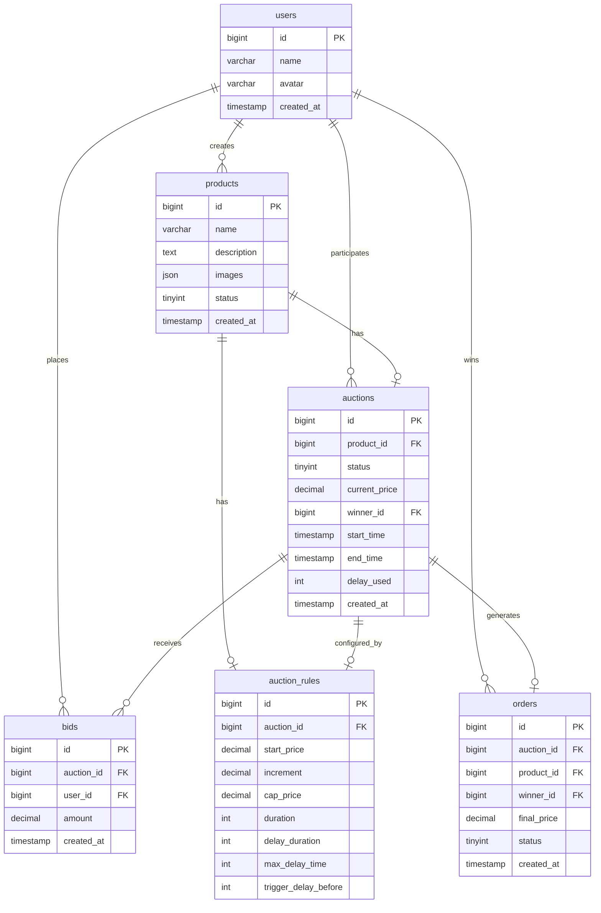

# Data Model: 直播竞拍全栈系统

## Entity Relationship Diagram



## Entity Definitions

### users (用户表)

| 字段 | 类型 | 约束 | 说明 |
|------|------|------|------|
| id | BIGINT | PK, AUTO_INCREMENT | 用户ID |
| name | VARCHAR(64) | NOT NULL | 用户名 |
| avatar | VARCHAR(256) | NULL | 头像URL |
| created_at | TIMESTAMP | DEFAULT CURRENT_TIMESTAMP | 创建时间 |

### products (商品表)

| 字段 | 类型 | 约束 | 说明 |
|------|------|------|------|
| id | BIGINT | PK, AUTO_INCREMENT | 商品ID |
| name | VARCHAR(128) | NOT NULL | 商品名称 |
| description | TEXT | NULL | 商品描述 |
| images | JSON | NULL | 商品图片列表 |
| status | TINYINT | DEFAULT 0 | 状态: 0=draft, 1=published |
| created_at | TIMESTAMP | DEFAULT CURRENT_TIMESTAMP | 创建时间 |

### auctions (竞拍场次表)

| 字段 | 类型 | 约束 | 说明 |
|------|------|------|------|
| id | BIGINT | PK, AUTO_INCREMENT | 竞拍ID |
| product_id | BIGINT | FK, NOT NULL | 关联商品ID |
| status | TINYINT | DEFAULT 0 | 状态: 0=pending, 1=ongoing, 2=delayed, 3=ended, 4=cancelled |
| current_price | DECIMAL(10,2) | DEFAULT 0 | 当前价格 |
| winner_id | BIGINT | FK, NULL | 当前领先者ID |
| start_time | TIMESTAMP | NOT NULL | 开始时间 |
| end_time | TIMESTAMP | NOT NULL | 结束时间 |
| delay_used | INT | DEFAULT 0 | 已延时秒数 |
| created_at | TIMESTAMP | DEFAULT CURRENT_TIMESTAMP | 创建时间 |

**索引**：
- `idx_product_id` ON (product_id)
- `idx_status` ON (status)
- `idx_start_time` ON (start_time)

### auction_rules (竞拍规则表)

| 字段 | 类型 | 约束 | 说明 |
|------|------|------|------|
| id | BIGINT | PK, AUTO_INCREMENT | 规则ID |
| auction_id | BIGINT | FK, UNIQUE, NOT NULL | 关联竞拍ID |
| start_price | DECIMAL(10,2) | DEFAULT 0 | 起拍价（默认0元） |
| increment | DECIMAL(10,2) | NOT NULL | 加价幅度 |
| cap_price | DECIMAL(10,2) | NULL | 封顶价 |
| duration | INT | NOT NULL | 竞拍时长（秒） |
| delay_duration | INT | DEFAULT 30 | 单次延时时长（秒） |
| max_delay_time | INT | DEFAULT 180 | 最大延时时长（秒） |
| trigger_delay_before | INT | DEFAULT 30 | 延时触发时间（秒） |

### bids (出价记录表)

| 字段 | 类型 | 约束 | 说明 |
|------|------|------|------|
| id | BIGINT | PK, AUTO_INCREMENT | 出价ID |
| auction_id | BIGINT | FK, NOT NULL | 关联竞拍ID |
| user_id | BIGINT | FK, NOT NULL | 出价用户ID |
| amount | DECIMAL(10,2) | NOT NULL | 出价金额 |
| created_at | TIMESTAMP | DEFAULT CURRENT_TIMESTAMP | 出价时间 |

**索引**：
- `idx_auction_id` ON (auction_id)
- `idx_user_id` ON (user_id)
- `idx_auction_created` ON (auction_id, created_at DESC)

### orders (订单表)

| 字段 | 类型 | 约束 | 说明 |
|------|------|------|------|
| id | BIGINT | PK, AUTO_INCREMENT | 订单ID |
| auction_id | BIGINT | FK, NOT NULL | 关联竞拍ID |
| product_id | BIGINT | FK, NOT NULL | 关联商品ID |
| winner_id | BIGINT | FK, NOT NULL | 中标者ID |
| final_price | DECIMAL(10,2) | NOT NULL | 成交价格 |
| status | TINYINT | DEFAULT 0 | 状态: 0=pending, 1=paid, 2=shipped, 3=completed |
| created_at | TIMESTAMP | DEFAULT CURRENT_TIMESTAMP | 创建时间 |

## State Transitions

### Auction Status

```
┌─────────┐    start_time     ┌─────────┐    bid in last 30s    ┌──────────┐
│ pending │ ─────────────────▶│ ongoing │ ─────────────────────▶│ delayed  │
└────┬────┘                   └────┬────┘                      └────┬─────┘
     │                             │                                │
     │ cancel                      │ end/cap_price                  │ max_delay
     │                             │                                │
     ▼                             ▼                                ▼
┌────────────┐               ┌────────┐                       ┌────────┐
│ cancelled  │               │ ended  │◄──────────────────────│ ended  │
└────────────┘               └────────┘                       └────────┘
```

### Order Status

```
┌─────────┐    pay    ┌────────┐    ship    ┌────────────┐    complete    ┌───────────┐
│ pending │ ─────────▶│  paid  │ ─────────▶│  shipped   │ ──────────────▶│ completed │
└─────────┘           └────────┘           └────────────┘                └───────────┘
```

## Redis Data Structures

### 分布式锁
```
Key: auction:bid:{auction_id}:lock
Value: {user_id}:{timestamp}
TTL: 5s
```

### 当前价格缓存
```
Key: auction:current_price:{auction_id}
Value: {price}:{winner_id}:{timestamp}
TTL: 1h
```

### 排名列表
```
Key: auction:ranking:{auction_id}
Type: ZSET
Member: {user_id}
Score: {bid_amount}
TTL: 1h
```

### WebSocket 房间成员
```
Key: ws:room:{auction_id}:members
Type: SET
Members: {client_id}
TTL: 24h
```
