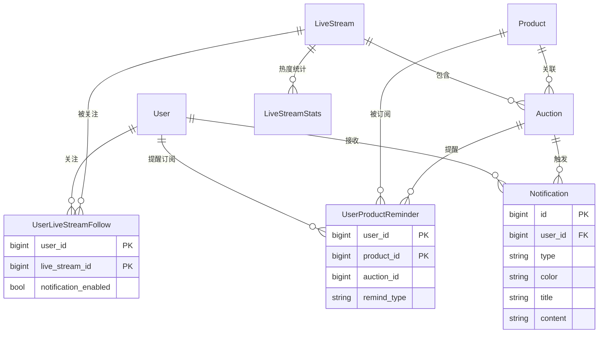
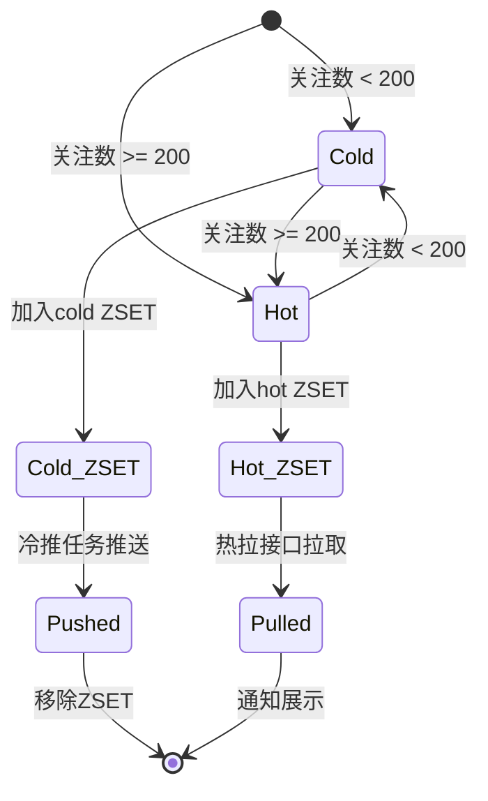
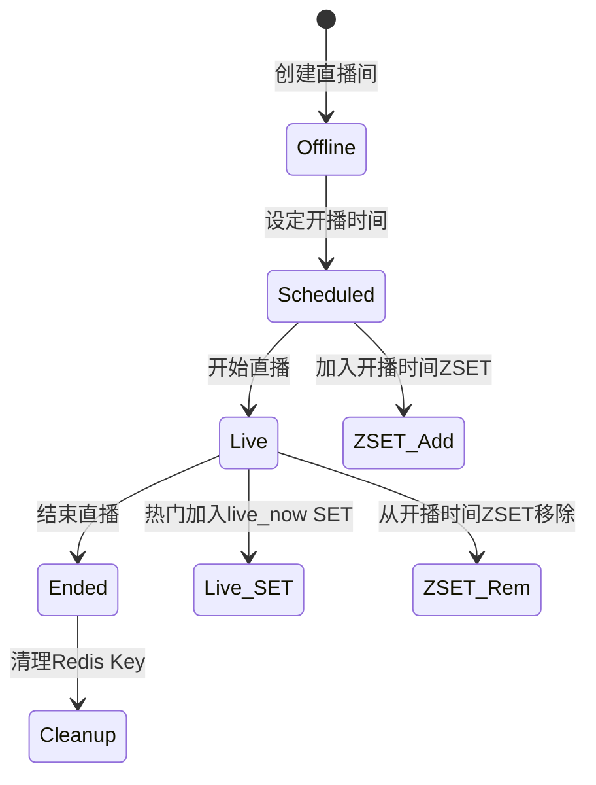

# Data Model: 直播间通知"冷推热拉"

---

## Database Tables

### user_product_reminders (新增)

商品提醒订阅表，存储用户对竞拍商品的"提醒我"订阅。

| 字段 | 类型 | 约束 | 说明 |
|------|------|------|------|
| id | BIGINT | PK, AUTO_INCREMENT | 主键 |
| user_id | BIGINT | NOT NULL, INDEX | 用户ID |
| product_id | BIGINT | NOT NULL, INDEX | 商品ID |
| auction_id | BIGINT | NULL, INDEX | 竞拍ID（可选） |
| live_stream_id | BIGINT | NULL, INDEX | 直播间ID（可选） |
| notification_enabled | TINYINT(1) | DEFAULT 1 | 是否接收通知 |
| remind_type | VARCHAR(32) | DEFAULT 'auction_start' | 提醒类型 |
| created_at | DATETIME | DEFAULT CURRENT_TIMESTAMP | 创建时间 |

**索引**:
- UNIQUE KEY `uk_user_product` (`user_id`, `product_id`)
- INDEX `idx_product_id` (`product_id`)
- INDEX `idx_live_stream_id` (`live_stream_id`)
- INDEX `idx_auction_id` (`auction_id`)

### notifications (修改)

新增 `color` 字段。

| 新增字段 | 类型 | 约束 | 说明 |
|----------|------|------|------|
| color | VARCHAR(16) | DEFAULT 'blue' | 通知颜色标识 |

---

## Redis Data Structures

### live_stream:cold:start_time (ZSET)

冷门直播间开播时间有序集合。

| 属性 | 说明 |
|------|------|
| Key | `live_stream:cold:start_time` |
| Type | ZSET |
| Member | 直播间ID (int64) |
| Score | 开播时间戳 (unix seconds) |

**用途**: 冷推任务通过 `ZRANGEBYSCORE [now, now+10min]` 精确获取需要推送的直播间。

### live_stream:hot:start_time (ZSET)

热门直播间开播时间有序集合。

| 属性 | 说明 |
|------|------|
| Key | `live_stream:hot:start_time` |
| Type | ZSET |
| Member | 直播间ID (int64) |
| Score | 开播时间戳 (unix seconds) |

**用途**: 热拉接口通过 `ZRANGEBYSCORE [now, now+1hour]` 获取即将开播的热门直播间。

### live_stream:hot:live_now (SET)

正在直播的热门直播间集合。

| 属性 | 说明 |
|------|------|
| Key | `live_stream:hot:live_now` |
| Type | SET |
| Member | 直播间ID (int64) |

**用途**: 热拉接口通过 `SMEMBERS` 快速获取正在直播的热门直播间。

### live_stream:{id}:stats (Hash)

直播间热度状态缓存。

| 属性 | 说明 |
|------|------|
| Key | `live_stream:{live_stream_id}:stats` |
| Type | Hash |

**Fields**:

| Field | 类型 | 说明 |
|-------|------|------|
| follower_count | int | 关注人数 |
| is_hot | 0/1 | 是否热门（≥200） |
| status | string | 直播状态：offline/scheduled/live/ended |
| scheduled_start_time | int | 计划开播时间戳 |
| actual_start_time | int | 实际开播时间戳 |

### user:{uid}:followed_live_streams (SET)

用户关注的直播间列表。

| 属性 | 说明 |
|------|------|
| Key | `user:{user_id}:followed_live_streams` |
| Type | SET |
| Member | 直播间ID (int64) |

**用途**: 热拉时快速判断用户是否关注了某个直播间。

### user:{uid}:product_reminders:start_time (ZSET)

用户商品提醒订阅。

| 属性 | 说明 |
|------|------|
| Key | `user:{user_id}:product_reminders:start_time` |
| Type | ZSET |
| Member | 竞拍ID (int64) |
| Score | 竞拍开始时间戳 (unix seconds) |

**用途**: 热拉时获取用户订阅的竞拍商品即将开始的提醒。

---

## Entity Relationships



---

## Notification Types

| 类型 | 常量名 | 颜色 | 说明 |
|------|--------|------|------|
| 直播即将开始 | `NotificationTypeLiveStarting` | blue | 冷门热门统一 |
| 正在直播 | `NotificationTypeLiveNow` | red | 重要/紧急 |
| 竞拍即将开始 | `NotificationTypeAuctionStarting` | red | 重要/紧急 |
| 竞拍成功 | `NotificationTypeAuctionWon` | green | 正向结果 |
| 出价被超越 | `NotificationTypeBidOutbid` | orange | 提醒重新出价 |
| 订单状态 | `NotificationTypeOrderStatus` | brown | 状态变更 |
| 竞拍未中标 | `NotificationTypeAuctionLost` | gray | 负面结果 |

---

## Hotness Threshold

```go
// 配置化热度阈值
const HotnessThreshold = 200

func (s *LiveStreamStatsService) IsHot(followerCount int) bool {
    return followerCount >= HotnessThreshold
}
```

---

## State Transitions

### 直播间热度状态



### 直播间生命周期

