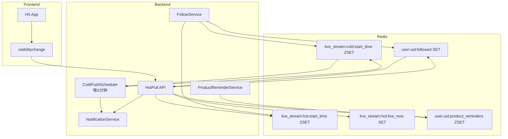

# Implementation Plan: 直播间通知"冷推热拉"机制

**Feature**: `20260528-livestream-notification-cold-push-hot-pull`
**Created**: 2026-05-28
**Status**: Draft

---

## Technical Context

### 技术栈

| 层级 | 技术 | 版本 |
|------|------|------|
| Backend | Go | 1.21+ |
| Cache | Redis | 7.x |
| Frontend | React + TypeScript | 18.x |
| State | React Hooks | - |
| ORM | GORM | 1.25+ |
| Metrics | Prometheus | - |

### 涉及项目

| 项目 | 路径 | 变更类型 |
|------|------|----------|
| auction-service | `backend/auction/` | 新增Redis ZSET操作、冷推任务、热拉接口 |
| H5 Frontend | `frontend/h5/` | 热拉触发、visibilitychange监听、颜色显示 |

### 依赖项

| 依赖 | 状态 | 说明 |
|------|------|------|
| Redis Client | ✅ 已配置 | `dao/redis.go` |
| NotificationService | ✅ 已实现 | `service/notification.go` |
| UserLiveStreamFollow | ✅ 已实现 | `model/user_live_stream_follow.go` |
| WebSocket Hub | ✅ 已实现 | `websocket/hub.go` |

---

## Constitution Check

| 原则 | 检查项 | 结果 |
|------|--------|------|
| **全栈一体化** | 前后端同步实现热拉触发 | ✅ 已规划 |
| **实时性优先** | Redis ZSET保证O(log N)查询效率 | ✅ 符合 |
| **质量保障** | 单元测试覆盖核心逻辑 | ✅ 已规划 |
| **可扩展性** | 配置化热度阈值（200） | ✅ 符合 |

### Fixed Rules 检查

| 规则 | 状态 |
|------|------|
| API First | ✅ 热拉接口定义先于实现 |
| Code Consistency | ✅ 复用现有NotificationService模式 |
| Real-Time Changes | ✅ ZSET精确定位，无延迟风险 |

---

## Phase 0: Research

**无需研究** - 技术方案已明确，无 NEEDS CLARIFICATION。

---

## Phase 1: Design & Contracts

### Data Model

详见 `data-model.md`

### API Contracts

详见 `contracts/`

### Quickstart

详见 `quickstart.md`

---

## Scope of Changes

### Backend (auction-service)

| 文件 | 变更类型 | 说明 |
|------|----------|------|
| `model/user_product_reminder.go` | 新增 | 商品提醒订阅模型 |
| `model/notification.go` | 修改 | 新增color字段、新通知类型 |
| `dao/user_product_reminder.go` | 新增 | 商品提醒DAO |
| `dao/live_stream_stats.go` | 新增 | 直播间热度统计DAO（Redis操作） |
| `service/live_stream_stats.go` | 新增 | 热度状态管理服务 |
| `service/cold_push_scheduler.go` | 新增 | 冷推定时任务 |
| `service/notification.go` | 修改 | 新增HotPullNotifications方法 |
| `handler/notification.go` | 修改 | 新增hot-pull接口 |
| `handler/product_reminder.go` | 新增 | 商品提醒接口 |
| `main.go` | 修改 | 注册新路由、启动冷推任务 |

### Frontend (H5)

| 文件 | 变更类型 | 说明 |
|------|----------|------|
| `hooks/useNotification.ts` | 修改 | 新增hotPullNotifications、visibilitychange监听 |
| `components/Notification/index.tsx` | 修改 | 颜色显示逻辑 |
| `api/notification.ts` | 修改 | 新增hot-pull API调用 |

---

## Architecture Diagram

---

## Implementation Strategy

### 阶段划分

| 阶段 | 任务 | 优先级 |
|------|------|--------|
| 1 | Redis ZSET基础设施 | P1 |
| 2 | 热度状态管理服务 | P1 |
| 3 | 冷推定时任务 | P1 |
| 4 | 热拉接口 | P1 |
| 5 | 商品提醒订阅 | P2 |
| 6 | 前端集成 | P2 |
| 7 | 数据校验任务 | P3 |

### MVP范围

阶段1-4完成后，基础冷推热拉功能即可上线。

---

## Next Step

执行 `/adk:sdd:tasks` 生成详细任务列表。