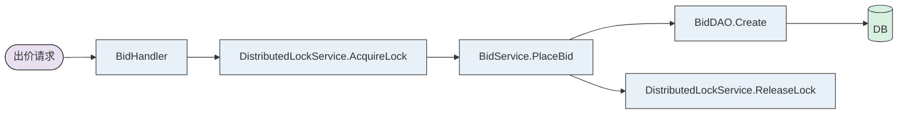
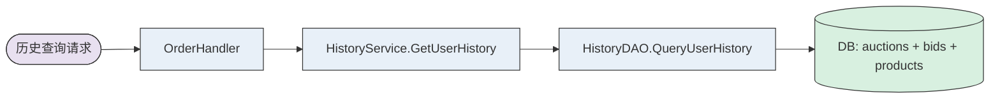
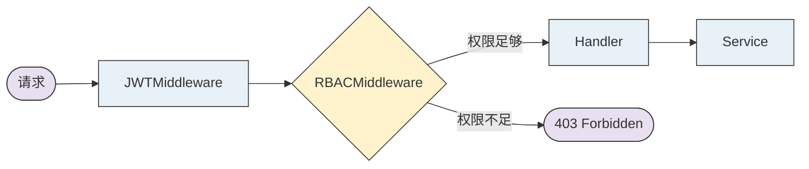

> Generated by [**TTADK**](https://bytedance.larkoffice.com/wiki/Gw0ewxEbHi1K0NkVd2YcNwvVnTg) (TikTok AI-Driven Development Kit) brainstorm command

## 概述

本文档描述了直播竞拍系统的四个核心功能完善任务的技术提案：
1. Redis状态同步启用
2. 分布式锁支持
3. 用户历史记录真实查询
4. 时间同步周期性推送
5. RBAC权限验证

采用**方案B: 完整重构方案**，在现有架构基础上引入新的服务层组件，提升系统的可扩展性和可靠性。

---

## Involved Projects

| Service (PSM) | Project Path | Change Type |
| --- | --- | --- |
| auction-service | backend/auction | Modified |
| product-service | backend/product | Modified |
| gateway-service | backend/gateway | Modified |

---

## Functional Modules

### 模块A: Redis状态同步与分布式锁

#### Feature Overview

在WebSocket连接中启用Redis状态同步，并引入分布式锁防止并发竞拍冲突。

#### DB Changes

| Change Type | Table/Field | Description |
| --- | --- | --- |
| 新增字段 | `auctions.creator_id` | 竞拍创建者ID（主播），用于归属检查 |

#### Code Changes

| Change Type | File/Method | Description |
| --- | --- | --- |
| New | `auction/service/lock.go#DistributedLockService` | Redis分布式锁服务 |
| New | `auction/websocket/manager.go#WebSocketManager` | 统一管理Hub和StateManager |
| Modified | `auction/websocket/hub.go#Hub` | 添加stateManager字段 |
| Modified | `auction/websocket/client.go#Client` | 连接时保存状态到Redis |
| Modified | `auction/service/bid.go#PlaceBid` | 使用分布式锁保护出价操作 |
| Modified | `auction/main.go#main` | 创建并注入新服务 |

#### Call Chain

---

### 模块B: 用户历史记录真实查询

#### Feature Overview

实现真实的用户竞拍历史查询，替代现有的模拟数据。

#### DB Changes

无需新增表，使用现有表联表查询。

#### Code Changes

| Change Type | File/Method | Description |
| --- | --- | --- |
| New | `product/dao/history.go#HistoryDAO` | 用户历史记录DAO |
| New | `product/service/history.go#HistoryService` | 历史记录服务 |
| Modified | `product/service/order.go#GetUserHistory` | 调用HistoryService |

#### Call Chain

---

### 模块C: 时间同步周期性推送

#### Feature Overview

每5秒向进行中的竞拍房间推送服务器时间，实现客户端倒计时精确同步。

#### Code Changes

| Change Type | File/Method | Description |
| --- | --- | --- |
| Modified | `auction/service/scheduler.go#Scheduler` | 添加时间同步推送任务 |
| Modified | `auction/websocket/time_sync.go#TimeSyncService` | 添加BroadcastTimeSync方法 |

#### Call Chain

---

### 模块D: RBAC权限验证

#### Feature Overview

实现基于角色的访问控制，支持普通用户、主播、平台管理员三种角色。

#### 角色定义

| Role ID | 角色名称 | 说明 |
| --- | --- | --- |
| 0 | 普通用户 | 参与竞拍 |
| 1 | 主播 | 管理自己的直播间和竞拍 |
| 2 | 平台管理员 | 管理所有资源 |

#### 权限矩阵

| 操作 | 普通用户 | 主播 | 平台管理员 |
| --- | --- | --- | --- |
| 查看竞拍列表 | ✅ | ✅ | ✅ |
| 出价竞拍 | ✅ | ✅ | ✅ |
| 创建竞拍 | ❌ | ✅ (自己的) | ✅ |
| 取消竞拍 | ❌ | ✅ (自己的) | ✅ |

#### DB Changes

| Change Type | Table/Field | Description |
| --- | --- | --- |
| 新增字段 | `users.role` | 用户角色，默认0（普通用户） |

#### Code Changes

| Change Type | File/Method | Description |
| --- | --- | --- |
| New | `gateway/middleware/rbac.go#RBACMiddleware` | 角色权限中间件 |
| New | `auction/middleware/rbac.go#RBACMiddleware` | 角色权限中间件 |
| Modified | `gateway/router/router.go` | 对敏感路由添加RBAC中间件 |
| Modified | `auction/model/user.go` | 添加Role常量和方法 |

#### Call Chain

---

## Risk Points

1. **破坏现有功能**: 重构可能影响现有测试。缓解措施：保持所有现有测试通过，增量添加测试。
2. **Redis不可用**: 分布式锁依赖Redis。缓解措施：降级为本地内存锁，记录错误日志，不影响主流程。
3. **权限配置错误**: 用户角色未正确设置。缓解措施：默认为普通用户，手动提权。
4. **并发竞拍冲突**: 分布式锁实现不当可能导致数据竞争。缓解措施：使用PEXPIRE自动续期，锁超时后自动释放。
5. **主播归属检查遗漏**: 主播可能操作他人资源。缓解措施：在敏感操作（创建/取消竞拍）中强制检查creator_id。

---

## 验收标准

| 任务 | 验收标准 |
| --- | --- |
| **Redis状态同步** | WebSocket连接时状态保存到Redis，重连后可恢复 |
| **分布式锁** | 并发出价测试通过，无数据竞争 |
| **用户历史记录** | GetUserHistory返回真实数据，含商品名、出价次数 |
| **时间同步推送** | 每5秒向进行中的竞拍推送服务器时间 |
| **RBAC权限** | 主播只能操作自己的竞拍，平台管理员可操作所有 |

---

## 实施计划

| 阶段 | 任务 | 预计时间 |
| --- | --- | --- |
| Phase 1 | Redis环境准备、启动服务 | 0.5小时 |
| Phase 2 | 分布式锁服务实现与测试 | 2小时 |
| Phase 3 | WebSocket状态同步集成 | 2小时 |
| Phase 4 | 用户历史记录查询实现 | 2小时 |
| Phase 5 | 时间同步推送实现 | 1小时 |
| Phase 6 | RBAC权限中间件实现 | 2小时 |
| Phase 7 | 集成测试与文档更新 | 1.5小时 |

**总计**: 约11小时（1-2个工作日）

