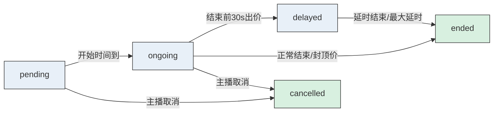

> Generated by [**TTADK**](https://bytedance.larkoffice.com/wiki/Gw0ewxEbHi1K0NkVd2YcNwvVnTg) (TikTok AI-Driven Development Kit) brainstorm command

## 项目概述

**项目名称**：「实时竞拍大师」—— 抖音电商直播竞拍全栈系统

**技术选型**：
- 后端：Go + Hertz + gorilla/websocket + MySQL + Redis
- 前端：React + TypeScript + Context + useReducer
- 架构：微服务 (CloudWeGo Kitex + Service Registry)
- 部署：Docker Compose

---

## 涉及服务

| 服务 (PSM) | 项目路径 | 变更类型 | 描述 |
| --- | --- | --- | --- |
| gateway-service | `backend/gateway` | 新建 | API网关、限流、路由转发 |
| product-service | `backend/product` | 新建 | 商品管理、订单管理 |
| auction-service | `backend/auction` | 新建 | 竞拍核心、WebSocket、状态机 |
| frontend-h5 | `frontend/h5` | 新建 | React H5 用户端 |
| frontend-admin | `frontend/admin` | 新建 | React PC 管理后台 |

---

## 功能模块

### 模块 A：竞拍商品管理（主播端）

#### 功能概述

主播端 PC 管理后台，支持商品发布、竞拍规则配置、商品状态管理、订单管理。

#### API 接口

| 方法 | 路径 | 描述 |
| --- | --- | --- |
| POST | `/api/v1/products` | 创建商品 |
| PUT | `/api/v1/products/{id}` | 更新商品 |
| GET | `/api/v1/products` | 商品列表 |
| POST | `/api/v1/products/{id}/rules` | 配置竞拍规则 |
| PUT | `/api/v1/auctions/{id}/cancel` | 取消竞拍 |
| GET | `/api/v1/orders` | 订单列表 |

#### 数据库变更

| 变更类型 | 表/字段 | 描述 |
| --- | --- | --- |
| 新建表 | `users` | 用户信息表 (id, name, avatar, created_at) |
| 新建表 | `products` | 商品信息表 (id, name, description, images, status, created_at) |
| 新建表 | `auction_rules` | 竞拍规则表 (auction_id, start_price 默认0, increment, cap_price, duration, delay_duration, max_delay_time, trigger_delay_before) |

#### 代码变更

| 变更类型 | 文件/方法 | 描述 |
| --- | --- | --- |
| 新建 | `product/model/product.go` | 商品数据模型 |
| 新建 | `product/model/auction_rule.go` | 竞拍规则模型 |
| 新建 | `product/handler/product.go` | 商品 CRUD Handler |
| 新建 | `product/handler/rule.go` | 规则配置 Handler |
| 新建 | `product/dao/product.go` | 商品数据访问层 |

#### 调用链

```
Request → Gateway → Product Handler → Product Service → Product DAO → MySQL
```

---

### 模块 B：实时竞拍核心

#### 功能概述

竞拍核心逻辑，包括实时出价、自动延时、状态机管理、排名同步。

#### B2 实时出价

**核心规则**：
- **0 元起拍**：`start_price` 默认值为 0，任何人都可以参与竞拍，无门槛限制
- **加价幅度校验**：`new_bid >= current_bid + increment`
- **封顶价判断**：达到封顶价自动成交

**锁选型说明**：

| 方案 | 适用场景 | 优缺点 |
| --- | --- | --- |
| **乐观锁** | 低冲突、读多写少 | 无锁开销，但高并发时冲突率高，需频繁重试 |
| **Redis 分布式锁** ✅ | 高冲突、写密集 | 保证强一致性，适合竞拍场景（100+人同时出价） |

**选择理由**：竞拍场景属于高冲突写密集型，乐观锁会导致大量重试，用户体验差。Redis 分布式锁可确保出价原子性，避免"一笔出价扣两次钱"的严重问题。

**Redis 分布式锁设计**：
```
Key: auction:bid:{auction_id}:lock
Value: {user_id}:{timestamp}
TTL: 5秒
```

**代码变更**：

| 变更类型 | 文件/方法 | 描述 |
| --- | --- | --- |
| 新建 | `auction/service/bid.go#PlaceBid` | 出价核心逻辑 |
| 新建 | `auction/lock/redis_lock.go#Acquire` | Redis 分布式锁 |
| 新建 | `auction/handler/bid.go#HandleBid` | HTTP 出价 Handler |

**调用链**：

```
用户出价 → Gateway限流 → Auction Handler → Redis加锁 → 状态校验 → 入库 → 广播通知
```

#### B3 自动延时机制

**延时规则**：
- 触发条件：竞拍结束前 30 秒内有出价
- 单次延时：10-30 秒（可配置）
- 最大延时上限：3 分钟

**延时计算逻辑**：
```go
if time.Until(endTime) <= 30*time.Second && bidPlaced {
    newDelay := min(delayDuration, maxTotalDelay - currentDelay)
    if newDelay > 0 {
        endTime += newDelay
        currentDelay += newDelay
        broadcastDelayNotification()
    }
}
```

**代码变更**：

| 变更类型 | 文件/方法 | 描述 |
| --- | --- | --- |
| 新建 | `auction/service/state_machine.go` | 状态机定义 |
| 新建 | `auction/service/delay.go#CheckDelay` | 延时检查逻辑 |
| 新建 | `auction/handler/ws.go#OnBid` | WebSocket 出价处理 |

#### B5 竞拍状态机

**状态定义**：

| 状态 | 值 | 描述 | 允许操作 |
| --- | --- | --- | --- |
| `pending` | 0 | 待开始 | 修改规则、取消 |
| `ongoing` | 1 | 进行中 | 出价 |
| `delayed` | 2 | 延时中 | 出价 |
| `ended` | 3 | 已结束 | 无 |
| `cancelled` | 4 | 已取消 | 无 |

**状态转换流程**：



**数据库变更**：

| 变更类型 | 表/字段 | 描述 |
| --- | --- | --- |
| 新建表 | `auctions` | 竞拍场次表 (id, product_id, status, current_price, winner_id, start_time, end_time, delay_used, created_at) |
| 新建表 | `bids` | 出价记录表 (id, auction_id, user_id, amount, created_at) |

---

### 模块 C：实时通信与通知

#### 功能概述

WebSocket 房间管理、实时消息推送、断线重连。

#### C1 WebSocket 房间管理

**架构设计**：

```
┌─────────────────────────────────────────┐
│            Auction Service              │
│  ┌─────────────────────────────────┐    │
│  │         WebSocket Hub            │    │
│  │  ┌────────┐ ┌────────┐          │    │
│  │  │Room 101│ │Room 102│ ...      │    │
│  │  └───┬────┘ └───┬────┘          │    │
│  │      │          │                │    │
│  │  [Client1,2,3] [Client1,2,3]    │    │
│  └─────────────────────────────────┘    │
└─────────────────────────────────────────┘
```

**代码变更**：

| 变更类型 | 文件/方法 | 描述 |
| --- | --- | --- |
| 新建 | `auction/websocket/hub.go` | Hub 房间管理 |
| 新建 | `auction/websocket/room.go` | 单个房间逻辑 |
| 新建 | `auction/websocket/client.go` | 客户端连接管理 |
| 新建 | `auction/websocket/message.go` | 消息类型定义 |
| 新建 | `auction/websocket/time_sync.go` | 时间同步机制 |
| 新建 | `auction/service/throttle.go` | 消息节流控制 |

#### C2 实时消息推送

**消息类型**：

| 消息类型 | 方向 | 触发场景 | 数据内容 |
| --- | --- | --- | --- |
| `bid_placed` | Server→Client | 有人出价 | 出价金额、用户、时间 |
| `rank_update` | Server→Client | 排名变化 | 最新排名列表 |
| `overtaken` | Server→Client | 被超越通知 | 超越者信息 |
| `delay_triggered` | Server→Client | 延时触发 | 新结束时间 |
| `auction_ended` | Server→Client | 竞拍结束 | 成交信息 |

#### C3 断线重连

**心跳保活**：
- 客户端每 30 秒发送 ping
- 超时 60 秒未收到 pong 则重连
- 重连采用指数退避：1s → 2s → 4s → 8s → max 30s

#### C4 倒计时毫秒级精度

**设计目标**：确保所有用户看到的倒计时精确到毫秒，误差 < 100ms

**前端实现**：
```typescript
// useCountdown.ts
const useCountdown = (serverEndTime: number) => {
  const [countdown, setCountdown] = useState(0);

  useEffect(() => {
    let frameId: number;

    const update = () => {
      // 使用 requestAnimationFrame 实现毫秒级精度
      const now = Date.now();
      const remaining = Math.max(0, serverEndTime - now);
      setCountdown(remaining);

      if (remaining > 0) {
        frameId = requestAnimationFrame(update);
      }
    };

    frameId = requestAnimationFrame(update);
    return () => cancelAnimationFrame(frameId);
  }, [serverEndTime]);

  return countdown;
};
```

**后端时间同步**：
- WebSocket 连接建立时，服务端下发 `server_time`
- 前端计算 `serverEndTime = server_time + remaining_duration`
- 定期（每 10 秒）通过 WebSocket 消息校准时间偏差

**时间偏差补偿**：
```
前端显示时间 = 服务端结束时间 - 本地当前时间 + 网络延迟补偿(≈50ms)
```

#### C5 防抖节流设计

**出价按钮防抖**：
```typescript
// BidButton.tsx
const handleBid = useMemo(
  () => debounce((amount: number) => {
    placeBid(amount);
  }, 500), // 500ms 内重复点击只触发一次
  []
);
```

**WebSocket 消息节流**：
```typescript
// websocket.ts
class ThrottledWebSocket {
  private messageQueue: Message[] = [];
  private isProcessing = false;

  // 消息发送节流：100ms 内最多发送一条
  send(message: Message) {
    this.messageQueue.push(message);
    if (!this.isProcessing) {
      this.processQueue();
    }
  }

  private processQueue = throttle(() => {
    if (this.messageQueue.length > 0) {
      const latest = this.messageQueue[this.messageQueue.length - 1];
      this.ws.send(JSON.stringify(latest));
      this.messageQueue = [];
    }
  }, 100);
}
```

**排名更新节流**：
- 服务端：每 200ms 最多推送一次 `rank_update` 消息
- 前端：使用 `requestAnimationFrame` 渲染排名变化，避免频繁重绘

---

### 模块 D：用户结果与历史

#### 功能概述

成交结果展示、模拟支付、历史竞拍记录。

#### API 接口

| 方法 | 路径 | 描述 |
| --- | --- | --- |
| GET | `/api/v1/auctions/{id}/result` | 竞拍结果 |
| POST | `/api/v1/orders/{id}/pay` | 模拟支付 |
| GET | `/api/v1/users/me/history` | 历史记录 |

#### 数据库变更

| 变更类型 | 表/字段 | 描述 |
| --- | --- | --- |
| 新建表 | `orders` | 订单表 (id, auction_id, product_id, winner_id, final_price, status, created_at) |

---

## 前端设计

### H5 用户端

#### 目录结构

```
frontend/h5/src/
├── pages/
│   ├── Home/              # 首页 - 竞拍商品列表
│   ├── Auction/           # 竞拍详情页
│   │   ├── LiveVideo.tsx  # 直播画面
│   │   ├── BidPanel.tsx   # 出价面板
│   │   ├── Ranking.tsx    # 实时排名
│   │   └── Countdown.tsx  # 倒计时
│   ├── Result/            # 成交结果页
│   └── History/           # 历史记录页
├── components/
│   ├── BidButton/         # 出价按钮(防抖)
│   ├── PriceDisplay/      # 价格展示(动画)
│   └── Notification/      # 消息提示组件
├── hooks/
│   ├── useWebSocket.ts    # WebSocket连接管理
│   ├── useAuctionState.ts # 竞拍状态管理
│   ├── useCountdown.ts    # 倒计时Hook (requestAnimationFrame + 时间校准)
│   └── useDebounce.ts     # 防抖Hook (出价按钮防抖)
├── store/
│   └── auctionContext.tsx # Context + useReducer
└── services/
    ├── api.ts             # HTTP API调用
    └── websocket.ts       # WebSocket封装
```

#### 状态管理

```typescript
type AuctionState = {
  currentAuction: Auction | null;
  bids: Bid[];
  ranking: Bidder[];
  countdown: number;
  status: AuctionStatus;
  wsConnected: boolean;
};

type AuctionAction =
  | { type: 'BID_PLACED'; payload: Bid }
  | { type: 'RANK_UPDATE'; payload: Bidder[] }
  | { type: 'DELAY_TRIGGERED'; payload: number }
  | { type: 'AUCTION_ENDED'; payload: AuctionResult }
  | { type: 'WS_CONNECTED' }
  | { type: 'WS_DISCONNECTED' };
```

### PC 管理后台

#### 目录结构

```
frontend/admin/src/
├── pages/
│   ├── Product/
│   │   ├── List.tsx       # 商品列表
│   │   ├── Create.tsx     # 商品创建
│   │   └── RuleConfig.tsx # 规则配置
│   ├── Auction/
│   │   ├── List.tsx       # 竞拍列表
│   │   └── Detail.tsx     # 竞拍详情
│   └── Order/
│       └── List.tsx       # 订单列表
└── components/
    ├── RuleForm/          # 规则配置表单
    └── ProductForm/       # 商品表单
```

---

## 网关设计

#### 限流配置

| 服务 | 限流策略 | QPS 上限 |
| --- | --- | --- |
| 出价接口 | 令牌桶 | 1000/s |
| 商品列表 | 滑动窗口 | 500/s |
| WebSocket 连接 | 连接数限制 | 1000/room |

#### 服务注册发现

使用 CloudWeGo Kitex + Service Registry：
- 服务启动时自动注册
- Gateway 通过服务发现获取实例列表
- 支持健康检查和负载均衡

---

## 部署架构

### Docker Compose 配置

```yaml
services:
  gateway:
    build: ./backend/gateway
    ports: ["8080:8080"]
    depends_on: [product, auction, redis, mysql]

  product:
    build: ./backend/product
    ports: ["8081:8081"]
    depends_on: [mysql, redis]

  auction:
    build: ./backend/auction
    ports: ["8082:8082", "8083:8083"]  # HTTP + WebSocket
    depends_on: [mysql, redis]

  redis:
    image: redis:7-alpine
    ports: ["6379:6379"]

  mysql:
    image: mysql:8
    environment:
      MYSQL_ROOT_PASSWORD: root
      MYSQL_DATABASE: auction
    ports: ["3306:3306"]
```

---

## 风险点

| 风险类型 | 描述 | 缓解措施 |
| --- | --- | --- |
| **高并发** | 100+人同时出价 | Redis 分布式锁 + 网关限流 |
| **WebSocket 稳定性** | 网络波动断连 | 心跳保活 + 指数退避重连 |
| **数据一致性** | 竞拍状态同步 | Redis 缓存 + MySQL 事务 |
| **延时精度** | 倒计时毫秒级 | 前端定时器 + 后端时间校准 |
| **分布式锁** | 锁竞争性能 | 锁粒度优化 + TTL 防死锁 |

---

## 开发优先级

### P0 - MVP 核心（第一周）

1. 商品发布与规则配置
2. 实时出价（含分布式锁）
3. WebSocket 房间管理
4. 竞拍状态机

### P1 - 完善功能（第二周）

1. 自动延时机制
2. 实时排名同步
3. 断线重连
4. PC 管理后台

### P2 - 体验优化（第三周）

1. 动画效果
2. 倒计时精度优化
3. 历史记录
4. 模拟支付
