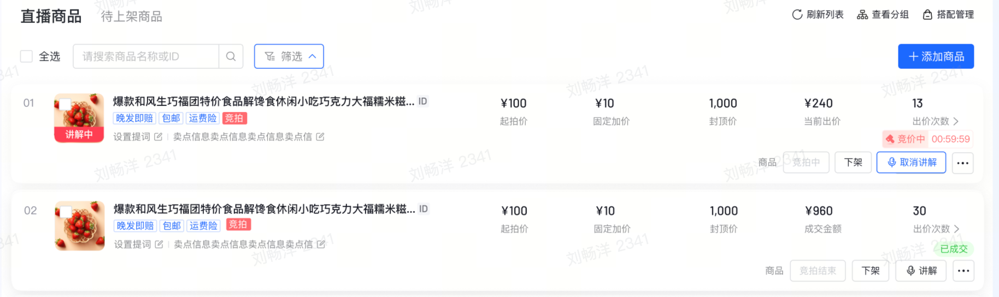
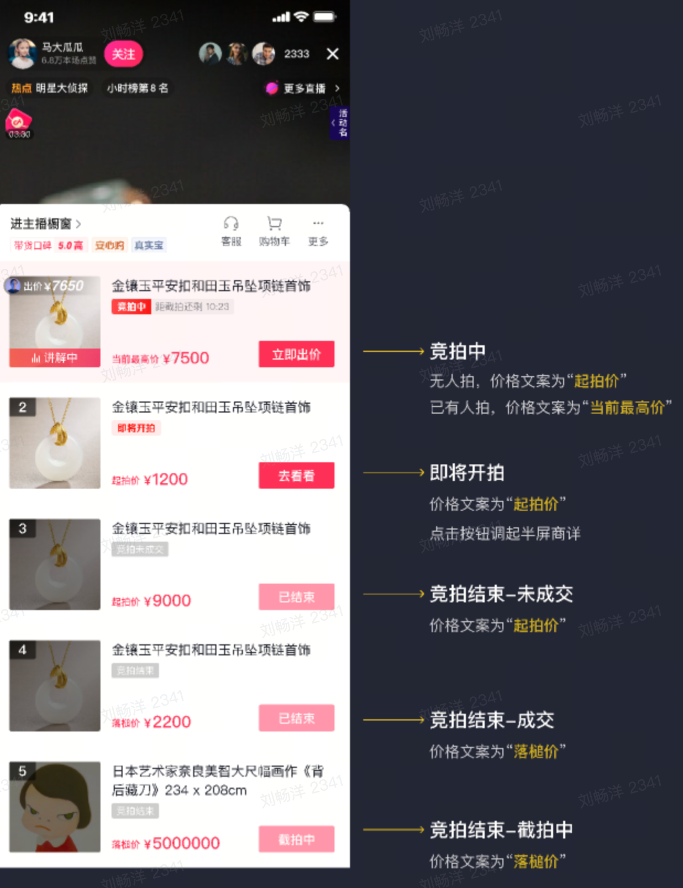
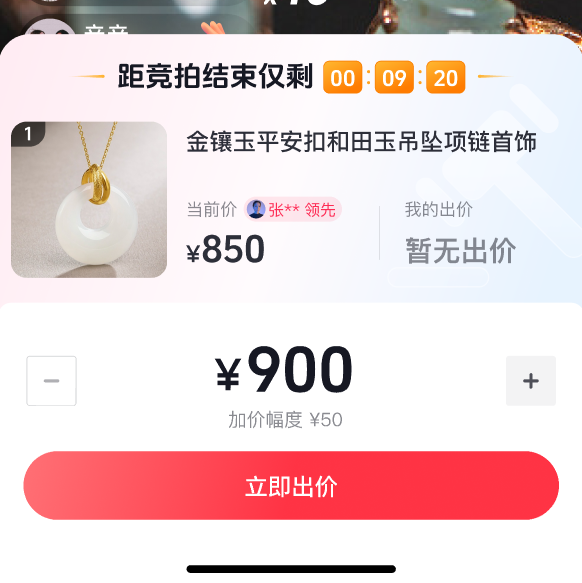
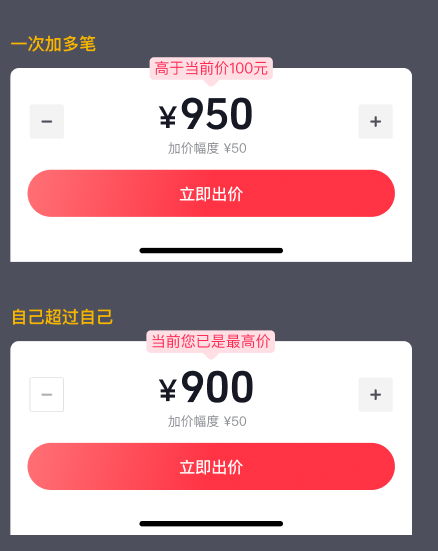
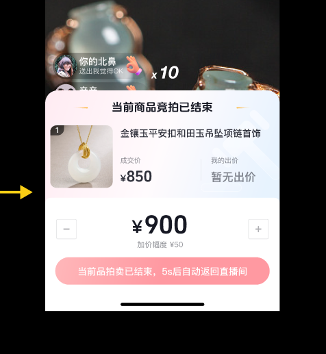
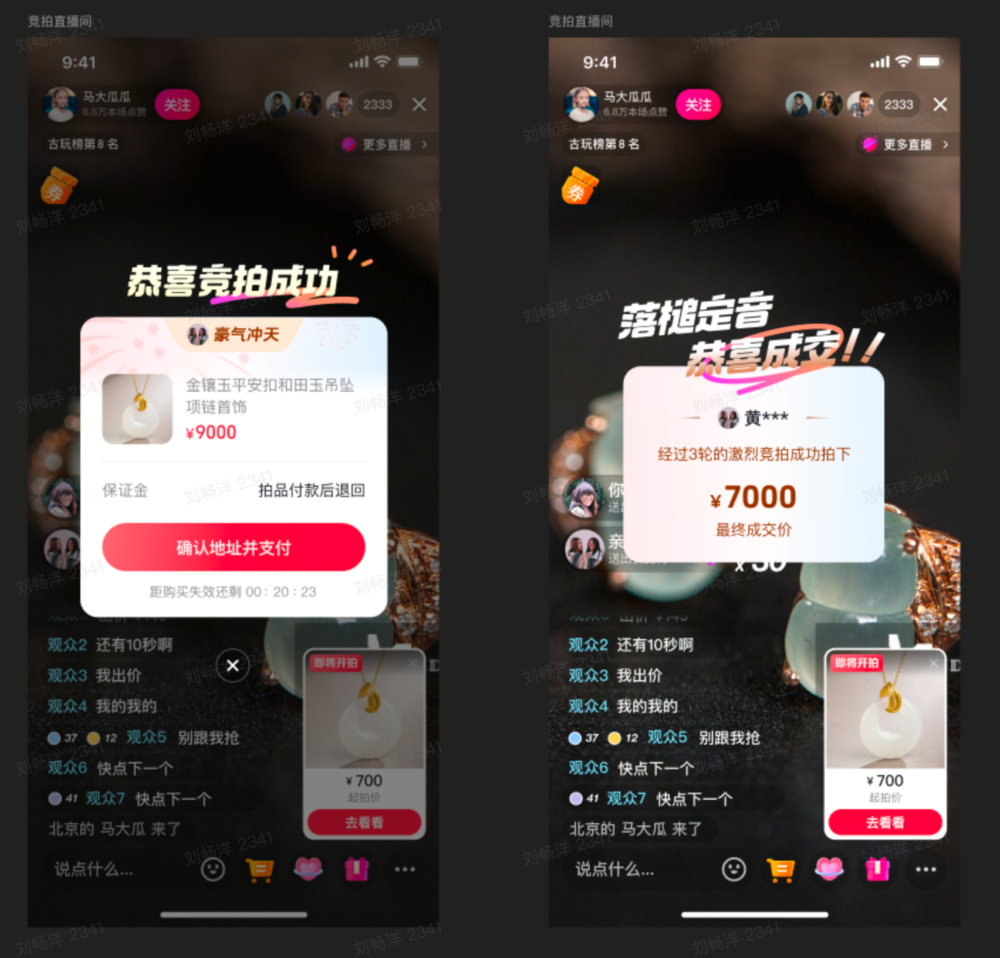

# 🛍️抖音电商AI全栈课题-直播竞拍全栈系统（宣讲版） 副本

> rocket **欢迎来到 2026 抖音电商AI全栈训练营！**
> 准备好接受挑战了吗？在这个课题中，你将亲手打造一套**直播竞拍全栈系统**，体验从 0 到 1 构建高并发实时应用的完整过程。当你完成时，你将拥有一份亮眼的项目经历，以及对 WebSocket、分布式锁、状态机等核心技术的深入理解。让我们一起开启这段技术之旅吧！ 💪

# 🎯 课题名称

**「实时竞拍大师」—— 抖音电商直播竞拍全栈系统设计与实现**

# 💡 课题背景

> sparkles 想象这样一个场景：直播间里，一件稀世珠宝正在竞拍，数百人同时出价，价格每秒都在跳动，气氛紧张到窒息——**这就是我们要你构建的系统！**

直播电商的兴起为高价值商品（珠宝、艺术品、二手奢侈品）开辟了全新赛道，这些商品价值难以统一定价，**竞拍**这种充满互动和竞争感的形式，能让市场动态定价最大化商品价值。你的任务是：

- 前端：基于 **React + TypeScript + WebSocket** 打造流畅的交互体验
- 后端：**优先Node/Go（其他语言也不限制**）**+ MySQL/Redis** 构建高并发处理能力
- 全流程：实现「商品上架 → 规则配置 → 实时出价 → 动态排名 → 竞拍成交」的完整闭环

# 🔥 核心挑战

## 挑战一：复杂规则的逻辑攻坚

竞拍规则就像一张精密的网，你需要把以下规则**零漏洞**地实现出来：

- 🔹 **0 元起拍** —— 从 0 开始，任何人都能参与
- 🔹 **加价幅度** —— 每次出价必须按固定幅度递增
- 🔹 **封顶价** —— 达到上限自动成交
- 🔹 **自动延时** —— 结束前有人出价，时间自动延长 10-30 秒
- 🔹 **异常取消** —— 主播可随时取消异常竞拍

## 挑战二：毫秒级实时同步

想象一下：直播间里有 **100+ 人同时狂点出价按钮**，每个人都想在最后一秒绝杀。你需要确保：

- ✅ 出价数据秒级同步，所有人看到的排名一致
- ✅ 倒计时精确到毫秒，不能有任何偏差
- ✅ WebSocket 连接稳定，即使网络波动也能自动重连
- ❌ 不能出现数据延迟、页面卡顿、排名错乱

**技术关键词**：WebSocket 长连接、心跳保活、乐观锁、防抖节流

# 📋 项目要求

> books **完成这个课题，你将收获什么？**
> ✅ 掌握 WebSocket 实时通信的完整实践
> ✅ 理解高并发场景下的数据一致性解决方案
> ✅ 学会状态机设计和复杂业务规则的代码实现
> ✅ 积累全栈项目经验，从数据库设计到前端交互一手包办

## 🏗️ 技术架构

- **前端**：React + TypeScript，组件化开发，状态管理清晰
- **后端**：Node.js 或 Go（语言不限），RESTful API + WebSocket 双通道
- **数据库**：MySQL / PostgreSQL 存储核心业务数据，Redis 应对高频读写
- **实时通信**：WebSocket 长连接，支持房间级隔离，多直播间互不干扰
- **代码质量**：分层架构合理，注释清晰，具备可维护性和扩展性

## 🎨 功能模块

### 商家/主播端（PC 管理后台）

- **📦 竞拍发布**：上传商品（名称、图片、介绍），配置竞拍规则（起拍价、加价幅度、时长、封顶价、延时机制）
- **📊 商品管理**：查看所有竞拍商品的状态、进度、成交结果；支持修改未开始竞拍的规则，取消异常竞拍
- **🧾 订单管理**：成交后自动生成订单，查看成交详情

### 用户端（移动端 H5/小程序）

- **📺 直播间**：可用固定视频或开源库模拟直播画面
- **👀 竞拍浏览**：查看商品列表、详情、规则、当前出价、参与人数，接收出价提醒
- **💰 出价参与**：手动出价、实时查看排名，接收「被超越」「竞拍延时」「竞拍结束」等关键提醒
- **🏆 结果查看**：查看成交情况，模拟支付流程，浏览历史竞拍记录
<table style="width: 100%; border-collapse: collapse;">
<tr>
<td style="border: 1px solid #ddd; padding: 8px; vertical-align: top;"></td>
<td style="border: 1px solid #ddd; padding: 8px; vertical-align: top;"></td>
<td style="border: 1px solid #ddd; padding: 8px; vertical-align: top;"></td>
</tr>
</table>

<table style="width: 100%; border-collapse: collapse;">
<tr>
<td style="border: 1px solid #ddd; padding: 8px; vertical-align: top;"></td>
<td style="border: 1px solid #ddd; padding: 8px; vertical-align: top;"></td>
</tr>
</table>

# 🏅 评分亮点（加分项）

想要在众多项目中脱颖而出？看看这些**加分方向**：

## 🤖 AI 全栈工具的深度应用

- 如何高效使用 AI 辅助编码？你的 AI 工具使用思路和流程沉淀
- AI 代码贡献率的合理性评估（不是越高越好，关键在于**关键决策点**的人工把控）

## 💫 极致的竞价氛围体验

- 动画效果：出价领先时「🎉 领先！」、被超越时「⚡ 被超越！」的情绪反馈
- 实时排行榜：让用户一眼看到自己的位置和差距
- 紧张感营造：倒计时动画、出价提示音等细节打磨

## ⚡ 高并发架构的硬核优化

- Redis 分层缓存策略，读写分离
- 分布式锁解决出价幂等性，**绝对不允许一笔出价扣两次钱**
- WebSocket 房间级路由隔离，支持单直播间 **1000+ 用户同时在线**（超越基础要求 10 倍！）
> 💡 **导师提示**：不必追求全部满分，选择你最有兴趣的方向深入打磨，**把一个亮点做到极致**，胜过十个浅尝辄止的功能！

# 👨‍🏫 导师团队

- @ou_84acdb17d4776d414a6619ddd966510a@ou_d10a56fe368afadb575d1b360e10072f
- @ou_8ab86796d447168b2a6a1bcf3e4f9f53@ou_cb388843834e8a122c7ed775a0fb3a5a@ou_d5c0a4af84ab30d9a6abfba7768a00fd@ou_6ddee3516342c0272de11f301ea91c38@ou_31b669514a2749365d3879a9d67d68bf

# 🔧 技术支持

> sparkles [Doubao-Seed-2.0-lite](https://cloud.bytedance.net/ark/region:ark+cn-beijing/model/detail?Id=doubao-seed-2-0-lite)
> EP：ep-20260514111437-7crsm
> APIKEY：ark-2af51d30-ed70-4061-a2cd-74f454ccc4e8-2282e

- 独家支持：字节跳动火山方舟资源
- 使用关注：一个课题所有成员共用账号，需要学生注意账号不外泄，仅用于本课题项目。
- 其他支持：同时提供TRAE操作配置指南[TRAE IDE模型配置操作指南](https://bytedance.larkoffice.com/wiki/AQsEwxVonibJvAkDDE7ct2qUnCf?from=from_copylink)

除AIcoding的token外，其他工具不提供官方资源，同学们可自由发挥~

# 评分标准

| <strong>评分维度</strong> | <strong>考察要点</strong> | <strong>建议权重</strong> |
| --- | --- | --- |
| <strong>技术实现与工程完整度</strong> | • 完整工程链路：从竞拍数据采集（出价、用户行为）、数据治理，到开源模型调用（可选）、后端服务（出价校验、状态机管控）、接口网关，再到前端交互（氛围动画、实时反馈），链路的顺畅闭环度。 | <strong>50%</strong> |
|   | • 系统可用性（断连重连、异常兜底）、性能、稳定性（缓存防击穿、数据一致性）、可观测性（竞拍状态监控、异常告警）。 |   |
| <strong>技术深度与创新性</strong> | • 技术选型（React/TypeScript/WebSocket/Node/Go/Redis/MySQL等）与课题场景（高并发直播竞拍）的适配性，是否针对核心挑战（实时同步、高并发、WebSocket不稳定）做针对性优化。 | <strong>25%</strong> |
|   | • 是否在技术方案上有独特或前瞻性思考（如房间级WebSocket路由隔离、出价幂等性设计、跨端状态同步优化等），能否体现技术差异化优势。 |   |
| <strong>AI使用与落地效果</strong> | • • AI工具使用情况：是否合理使用AI工具（代码生成工具、开源模型调用工具、数据处理工具等），工具选择与课题需求的适配性，使用流程是否规范、可追溯。 | <strong>15%</strong> |
|   | • AI代码贡献率：AI生成代码占项目核心代码（前后端业务逻辑、模型调用、交互组件）的比例，生成代码是否规范、可复用。 |   |
| <strong>项目材料完整度</strong> | • 提交的方案文档、演示视频（双端功能演示、高并发场景测试）、代码库等材料是否完整、规范，无缺失关键内容？ | <strong>10%</strong> |
|   | • 方案阐述是否清晰、有条理，能明确体现核心挑战、技术方案、评判亮点；演示效果是否直观，能清晰展示全流程功能与技术优势？ |   |

# 奖励收获

- **卓越项目团队 (1 )**
    - **直通 Offer**：团队核心成员直接获得**录用意向/直通终面。**
    - **现金奖励**：提供极具竞争力的现金奖励（2万元）
    - **荣誉奖杯与证书**。
- **优秀项目团队 (20)**
    - **优先录用通道**：**团队成员直通面试。**
    - **获奖证书**。
- **所有完成项目的团队**
    - **项目参与证明**：官方出具的《AI 全栈项目挑战》项目参与证明。
    - **纪念礼品**：定制项目纪念品。

# 关键节点

- **5.20 课题讲解**
- **5.21 导师分配**
- **5.20 - 6.10  课题挑战**
- **6.11 - 6.12 项目演示**
- **颁奖&面聊**
- **成功入职**

# 答疑

> tada **准备好了吗？**
> 这不仅仅是一个课题，而是一次**全栈工程师的实战演练**。当你看到自己的系统在模拟的高并发场景下稳定运行，当看到实时排名秒级刷新、竞拍氛围紧张刺激——那种成就感，将是你技术成长路上最珍贵的记忆。
> **现在，打开你的 IDE，开始这段精彩的旅程吧！** 🚀🔥
> 有任何问题，随时联系导师团队，我们随时为你答疑解惑！

